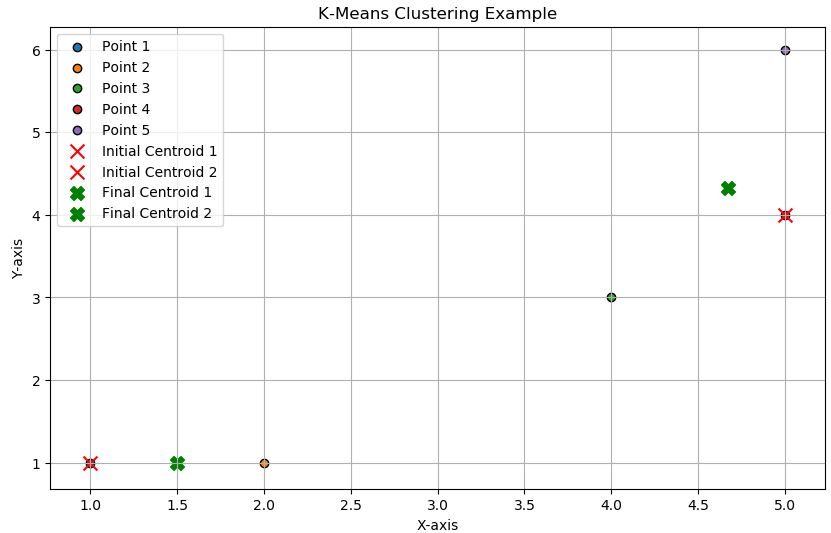

# K-Means Clustering: A Step-by-Step Example

## Introduction
We want to form 2 clusters (k=2) using a simple dataset with five points in 2D space.
## Dataset
Let's consider a simple dataset with five points in 2D space:
- Point 1: (1, 1)
- Point 2: (2, 1)
- Point 3: (4, 3)
- Point 4: (5, 4)
- Point 5: (5, 6)

## Step 1: Initialization
Choose k initial centroids randomly from the data points. Let's say we randomly choose:

- **Centroid 1**: (1, 1)
- **Centroid 2**: (5, 4)

## Step 2: Assignment
Assign each data point to the nearest centroid based on the Euclidean distance.

Calculate the Euclidean distance from each point to each centroid:

- **Distance(Point 1, Centroid 1)** = sqrt((1-1)^2 + (1-1)^2) = 0
- **Distance(Point 1, Centroid 2)** = sqrt((1-5)^2 + (1-4)^2) = 5

- **Distance(Point 2, Centroid 1)** = sqrt((2-1)^2 + (1-1)^2) = 1
- **Distance(Point 2, Centroid 2)** = sqrt((2-5)^2 + (1-4)^2) = 4.24

- **Distance(Point 3, Centroid 1)** = sqrt((4-1)^2 + (3-1)^2) = 3.61
- **Distance(Point 3, Centroid 2)** = sqrt((4-5)^2 + (3-4)^2) = 1.41

- **Distance(Point 4, Centroid 1)** = sqrt((5-1)^2 + (4-1)^2) = 5
- **Distance(Point 4, Centroid 2)** = sqrt((5-5)^2 + (4-4)^2) = 0

- **Distance(Point 5, Centroid 1)** = sqrt((5-1)^2 + (6-1)^2) = 6.4
- **Distance(Point 5, Centroid 2)** = sqrt((5-5)^2 + (6-4)^2) = 2

Based on these distances, assign each point to the nearest centroid:

- **Point 1**: Centroid 1
- **Point 2**: Centroid 1
- **Point 3**: Centroid 2
- **Point 4**: Centroid 2
- **Point 5**: Centroid 2

## Step 3: Update
Recalculate the centroids as the mean of all data points assigned to each cluster.

**New Centroid 1**:
- Mean of Points (1, 1) and (2, 1): ((1+2)/2, (1+1)/2) = (1.5, 1)

**New Centroid 2**:
- Mean of Points (4, 3), (5, 4), and (5, 6): ((4+5+5)/3, (3+4+6)/3) = (4.67, 4.33)

## Step 4: Repeat
Repeat the assignment and update steps until the centroids no longer change.

**New Assignments**:
Calculate the distances again:

- **Distance(Point 1, New Centroid 1)** = sqrt((1-1.5)^2 + (1-1)^2) = 0.5
- **Distance(Point 1, New Centroid 2)** = sqrt((1-4.67)^2 + (1-4.33)^2) = 5.11

- **Distance(Point 2, New Centroid 1)** = sqrt((2-1.5)^2 + (1-1)^2) = 0.5
- **Distance(Point 2, New Centroid 2)** = sqrt((2-4.67)^2 + (1-4.33)^2) = 4.51

- **Distance(Point 3, New Centroid 1)** = sqrt((4-1.5)^2 + (3-1)^2) = 3.61
- **Distance(Point 3, New Centroid 2)** = sqrt((4-4.67)^2 + (3-4.33)^2) = 1.39

- **Distance(Point 4, New Centroid 1)** = sqrt((5-1.5)^2 + (4-1)^2) = 5.32
- **Distance(Point 4, New Centroid 2)** = sqrt((5-4.67)^2 + (4-4.33)^2) = 0.47

- **Distance(Point 5, New Centroid 1)** = sqrt((5-1.5)^2 + (6-1)^2) = 6.72
- **Distance(Point 5, New Centroid 2)** = sqrt((5-4.67)^2 + (6-4.33)^2) = 1.68

**New Assignments**:

- **Point 1**: New Centroid 1
- **Point 2**: New Centroid 1
- **Point 3**: New Centroid 2
- **Point 4**: New Centroid 2
- **Point 5**: New Centroid 2

Since the assignments did not change, the algorithm stops.

## Summary of Final Clusters
- **Cluster 1 (Centroid: (1.5, 1))**:
  - Points: (1, 1), (2, 1)
  
- **Cluster 2 (Centroid: (4.67, 4.33))**:
  - Points: (4, 3), (5, 4), (5, 6)

This example shows how K-means clustering iteratively updates centroids and reassigns points to minimize the within-cluster variance.
