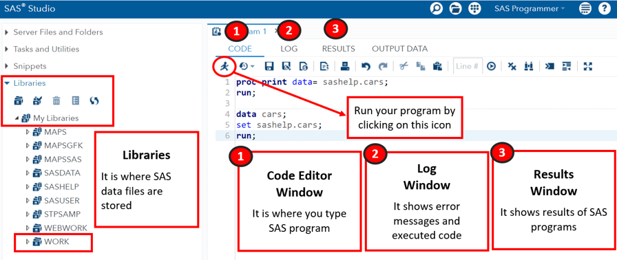
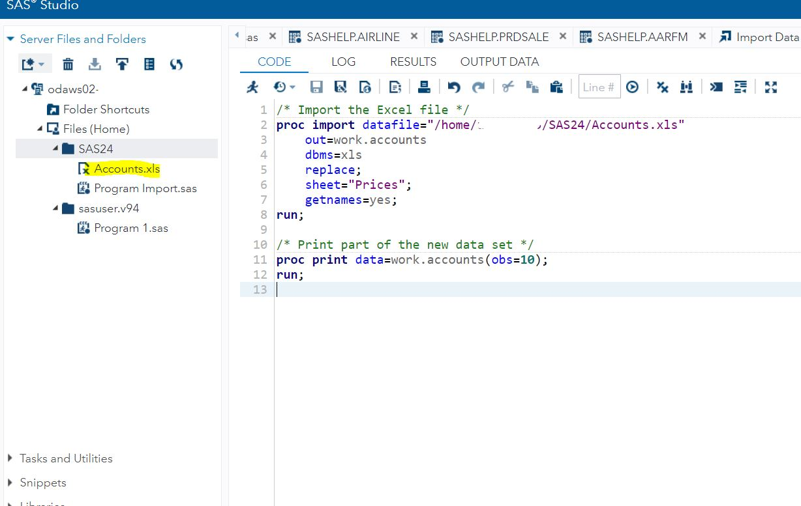
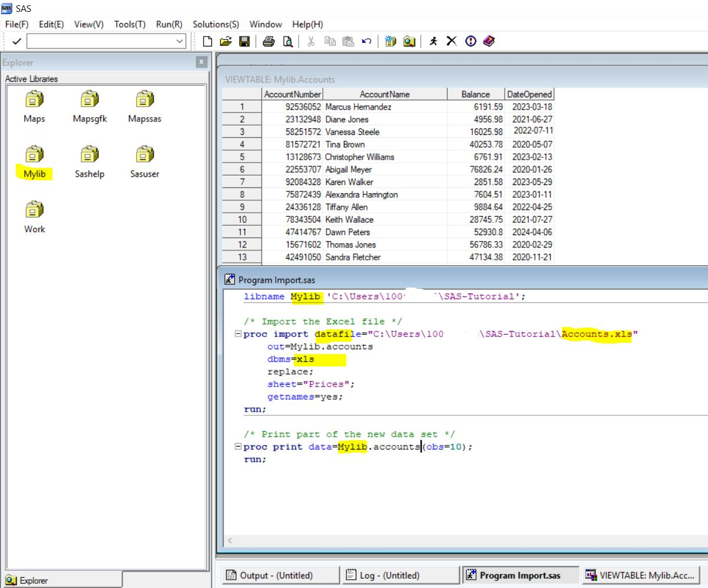

# SAS Tutorials

- **Tutorial 1: SAS Base Part 1**  [Dataset Creation](https://github.com/mdalmaruf/SAS-Tutorial/blob/main/SAS%20Basic%20Part%201.md)
  
- **Tutorial 2: SAS Base Part 2** [Load Local data/ PC files](https://github.com/mdalmaruf/SAS-Tutorial/blob/main/SAS%20Basic%20Part%202.md)
  
- **Tutorial 3:** [Descriptive Data Analysis SAS Studio](https://github.com/mdalmaruf/SAS-Tutorial/blob/main/SAS%20%20Basic%20Part%203.md)
  
- **Tutorial 4:** [ANOVA on AmesHousing3 Dataset](https://github.com/mdalmaruf/SAS-Tutorial/blob/main/SAS%20Basic%20Part%204.md)
  
- **Tutorial 5:** [Post Hoc Test](https://github.com/mdalmaruf/SAS-Tutorial/blob/main/SAS%20Basic%20Part%205.md)

Feel free to navigate through these tutorials to enhance your understanding of SAS and its applications.

# Getting Started with SAS Studio and SAS Base Software

SAS (Statistical Analysis System) is a powerful software suite used for advanced analytics, business intelligence, data management, and predictive analytics. In this guide, we will walk you through the steps to understand SAS programm set up your environment in SAS Studio, create folders, and upload files.

## Introduction to Writing a SAS Program

Writing a SAS program involves understanding the key components and the structure of the code. A typical SAS program consists of three main parts: Data Steps, PROC Steps, and Output Customization. Each part serves a specific purpose in the data analysis process.

### Key Components of a SAS Program

#### Data Steps
Data steps are used to create and manipulate data sets. They allow you to read in data, modify it, and create new data sets.

#### PROC Steps
PROC (procedure) steps are used to analyze the data. They include procedures for statistical analysis, data summarization, and reporting.

#### Output Customization
Output customization involves setting titles, footnotes, and formatting the output to make it more readable and presentable.


### Example of a SAS Program

Here's a simple example of a SAS program that reads in data, processes it, and generates a report:

```sas
/*************************************/
/* Step 1: Create and Read Data      */
/*************************************/
data sales;
   input Region $ Sales;
   datalines;
North 100
South 150
East 200
West 250
;
run;

/*************************************/
/* Step 2: Analyze Data              */
/*************************************/
proc means data=sales;
   var Sales;
run;

/*************************************/
/* Step 3: Customize Output          */
/*************************************/
title 'Sales Report';
proc print data=sales;
run;
title;
```
The `data` step creates a new data set named sales and reads in data using the datalines statement.
The `proc` means step calculates basic statistics (mean, min, max) for the Sales variable.
The `proc print` step prints the data set sales with a custom title "Sales Report"

## Setting Up SAS Studio

SAS Studio is a web-based interface to SAS that enables you to write code, run programs, and visualize results. Here’s how to get started:

### Accessing SAS Studio

1. **Login to SAS Studio**:
   Open your browser and navigate to the SAS Studio login page [https://welcome.oda.sas.com/]. Enter your credentials to access the workspace.



### Creating a Folder

To organize your files, you need to create a folder within SAS Studio:

1. **Navigate to Files (Home)**:
   On the left-hand side, under `Server Files and Folders`, locate `Files (Home)`.

2. **Create a New Folder**:
   Right-click on `Files (Home)` and select `New Folder`. Name your folder (e.g., `SAS24`) and click `Save`.
   
### Uploading Files

Once your folder is created, you can upload files into it:

1. **Select the Folder**:
   Click on the newly created folder (e.g., `SAS24`).

2. **Upload File**:
   Click on the upload icon (or drag and drop your file) to upload files into the selected folder. Choose the file you want to upload (e.g., `Accounts.xls`).

3. **Confirm Upload**:
   After uploading, you should see the file listed under the folder.



### Importing Data

To work with the uploaded data, you need to import it into a SAS dataset:

1. **Select the File**:
   Click on the uploaded file (e.g., `Accounts.xls`).

2. **Import Data**:
   In the right pane, you will see the `Import Data` task. Configure the settings such as the worksheet name and output data set name. Click `Run` to import the data.

3. **View Imported Data**:
   Once the import is complete, you can view the data in the `OUTPUT DATA` tab.


## Using SAS Base Software on Windows

### Open SAS Software:
Launch the SAS software on your Windows machine. Find the installation instruction from university software portal for SAS software.

### Create a Library Connected to a Local Folder:
Use the LIBNAME statement to assign a library to a local directory. This will allow you to access and manage datasets stored in that directory.

```sas
/* Assign a library */
libname Mylib 'C:\Users\username\SAS-Tutorial';
```
Replace /username/Accounts.xlsx with the correct path to your uploaded file.


### Ensure the Excel File is Accessible:
Save the `Accounts.xlsx` file to the directory `C:\Users\username\SAS-Tutorial`.

### Import the Excel File:
Open a new SAS program. Use the following code to import the data from the Excel file into the `MyLib` library:

```sas

/* Assign a library */
libname Mylib 'C:\Users\username\SAS-Tutorial';

/* Import the Excel file */
proc import datafile="C:\Users\username\SAS-Tutorial\Accounts.xlsx"
    out=Mylib.accounts
    dbms=xlsx
    replace;
    sheet="Prices";
    getnames=yes;
run;

/* Print part of the new data set */
proc print data=Mylib.accounts(obs=10);
title "An overview of Accounts Information";
run;
```


### View the Dataset:
In the SAS Explorer window, navigate to `MyLib` and double-click on the `Accounts` dataset to view it.

### Saving SAS Programs:
Saving SAS Programs in the MyLib Directory
If you want to keep your SAS programs and datasets together in the same directory, you can save your `.sas` files to the same location you assigned to `MyLib`. However, note that the SAS libraries (`MyLib`, `Work`, etc.) in the SAS environment are not designed to store .sas program files. Instead, store these files on your local file system and reference them as needed.


To save your SAS program:
1. Go to `File` -> `Save As`.
2. Navigate to the directory you assigned to `MyLib` (e.g., `C:\Users\username\SAS-Tutorial`).
3. Provide a name for your file (e.g., `Program Import.sas`).
4. Click `Save`.

### Example SAS Program
Here’s an example of a simple SAS program:

```sas
/* Step 1: Assign a library */
libname mylib 'C:\Users\username\SAS-Tutorial';

/* Step 2: Import the dataset into MyLib */
proc import datafile='C:\Users\username\SAS-Tutorial\Accounts.xlsx'
    out=Mylib.accounts
    dbms=xlsx
    replace;
    sheet='Prices';
    getnames=yes;
run;

/* Step 3: Print the dataset to confirm the import */
proc print data=Mylib.accounts(obs=10);
title "An overview of Accounts Information";

run;
```
# Commonly Used Keywords and Statements in SAS with Examples

Before starting to write programs in SAS, it's essential to be familiar with some commonly used keywords, syntax, and statements. These can be broadly categorized into three parts: Data Steps, PROC Steps, and Output Customization. Here are 25 keywords and concepts that everyone should know:

## Data Steps

**1. `data`: Creates a new data set.** Example: `data dataset_name;`

**2. `input`: Defines variables to read from the input data.** Example: `input var1 var2 $;`

**3. `datalines`: Provides data lines directly within the DATA step.** Example: `datalines;`

**4. `set`: Reads an existing data set.** Example: `set dataset_name;`

**5. `if`: Applies a condition to select observations.** Example: `if condition then action;`

**6. `where`: Filters data based on a condition.** Example: `where condition;`

**7. `keep`: Specifies variables to retain in the data set.** Example: `keep var1 var2;`

**8. `drop`: Specifies variables to exclude from the data set.** Example: `drop var1 var2;`

**9. `merge`: Combines two or more data sets based on a common variable.** Example: `merge dataset1 dataset2;`

**10. `by`: Specifies the variable(s) to use for grouping.** Example: `by var;`

**11. `retain`: Retains the value of a variable across iterations of the DATA step.** Example: `retain var;`

**12. `array`: Defines an array of variables.** Example: `array nums[3] num1-num3;`

**13. `length`: Defines the length of a variable.** Example: `length var $ 10;`

**14. `libname`: Assigns a library reference to a directory.** Example: `libname mylib 'C:\path\to\directory';`

## PROC Steps

**15. `proc`: Initiates a procedure step.** Example: `proc print data=dataset_name;`

**16. `run`: Executes preceding steps or statements.** Example: `run;`

**17. `quit`: Exits a procedure or cancels the current step.** Example: `quit;`

**18. `format`: Assigns formats to variables for display.** Example: `format var date9.;`

**19. `label`: Assigns descriptive labels to variables.** Example: `label var='Label';`

## Output Customization

**20. `title`: Sets the title for the output.** Example: `title 'Title Text';`

**21. `footnote`: Sets footnotes for the output.** Example: `footnote 'Footnote Text';`

**22. `infile`: Specifies an external file to read data from.** Example: `infile 'file.txt';`

**23. `file`: Specifies an external file to write data to.** Example: `file 'output.txt';`


**24. `put`: Writes data to an external file.** Example: `put var;`

**25. `in`: Specifies data set options for input.** Example: `set dataset_name (where=(condition));`

These keywords and statements form the foundation of SAS programming and are essential for creating, manipulating, and analyzing data sets, as well as generating reports.
