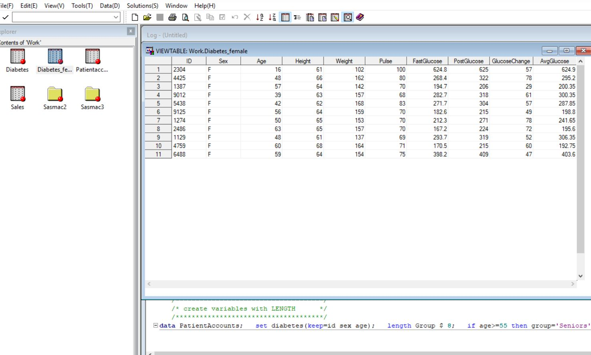
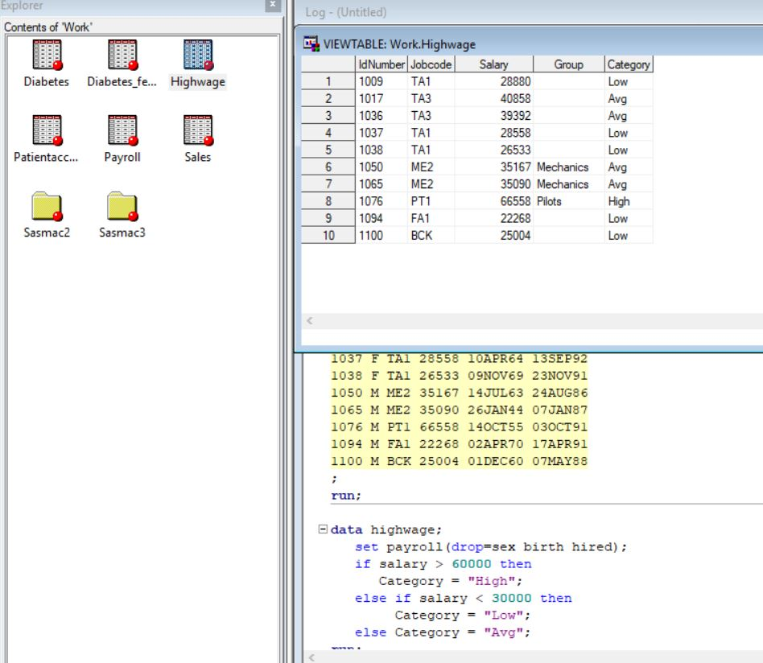

# SAS Base Software: SAS Basic Part 2

## Overview

If you have PC database files such as Microsoft Excel spreadsheets, Lotus spreadsheets, or Microsoft Access files, you can use SAS to import these files and create SAS data sets. Once you have the data in SAS data sets, you can process them as needed in SAS. You can also export SAS data to a number of PC file formats.

To read PC database files, you use the `PROC IMPORT` procedure. `PROC IMPORT` reads the input file and writes the data to a SAS data set, with the SAS variables defined based on the input records. You control the results with options and statements that are specific to the input data source.

- `PROC IMPORT` is available only on Windows and UNIX.
- You must have SAS/ACCESS Interface to PC Files licensed to read PC database files. However, even without SAS/ACCESS Interface to PC Files you can import and export delimited external files (files containing columns of data values that are separated by a delimiter such as a blank or a comma).

### <span style="color:orangered">Point-and-Click Method</span>

If you have SAS/ACCESS Interface to PC Files licensed, you can import PC database files using the Import Wizard:

1. In SAS, click **File > Import Data**.
2. When the Import Wizard opens, follow directions for importing data.

You can view and save the `PROC IMPORT` code that the Import Wizard generates.

## Example

Suppose that you want to import two files, a Microsoft Excel spreadsheet and a Microsoft Access table. The following programs show you how to read the data using options specific to the given file format, create SAS data sets, and print the new data sets.

```sas
/*********************************************/
/* import the Excel file                     */
/*********************************************/
proc import datafile="c:\myfiles\Accounts.xls"
    out=sasuser.accounts;
    sheet="Prices";
    getnames=no;
run;

/* print part of the new data set */
proc print data=sasuser.accounts(obs=10);
run;

/*********************************************/
/* import the Access file                    */
/*********************************************/
proc import table="customers"
    out=sasuser.cust dbms=access;
    uid="admin";
    pwd="";
    database="c:\myfiles\east.mdb";
    wgdb="c:\winnt\system32\security.mdb";
run;

/* print part of the new data set */
proc print data=sasuser.cust(obs=5);
run;
```
## Creating the Required .db or .mdb Files
If you don't have the database files (`east.mdb` and `security.mdb`), you can create them with the following steps:
### Tools Required

To create and manipulate Microsoft Access databases, you can use:

- **Microsoft Access**: If you have it installed.
- **MDB Viewer Plus**: A free viewer for Microsoft Access database files.
- **DB Browser for SQLite**: An open-source tool to create, design, and edit database files compatible with SQLite.

### Creating the .db or .mdb Files

- #### Using Microsoft Access:

    1. Open Microsoft Access.
    2. Create a new database and save it as `east.mdb`.
    3. Create a table named `customers` with fields such as `CustomerID`, `CustomerName`, `ContactName`, `Country`, etc.
    4. Save and close the database.
    5. Repeat the steps to create `security.mdb` if necessary.

- #### Using MDB Viewer Plus:

    1. Open MDB Viewer Plus.
    2. Create a new database and save it as `east.mdb`.
    3. Add a new table named `customers` with the required fields.
    4. Save the database.

- #### Using DB Browser for [SQLite](https://sqlitebrowser.org/dl/):

    1. **Download DB Browser for SQLite**:
        - Go to the [DB Browser for SQLite website](https://sqlitebrowser.org/dl/).
        - Download the appropriate installer for your operating system.
    
    2. **Install DB Browser for SQLite**:
        - Follow the installation instructions for your operating system.
        - Launch the application after installation.

    - ##### Creating a New Database and Table

    - ##### Step 1: Create a New Database

        1. Open DB Browser for SQLite.
        2. Click on `New Database`.
        3. Choose a location to save the new database file and name it `east.db`.
        4. Click `Save`.

    - ##### Step 2: Connect to the New Database

        - The database `east.db` is already open in DB Browser for SQLite after creation.

    - ##### Step 3: Create a Table Named `customers`

        1. In the main window, go to the `Database Structure` tab.
        2. Click on `Create Table`.
        3. Name the table `customers`.

        4. Add the required fields:
            - Field Name: `CustomerID`, Field Type: `INTEGER`
            - Field Name: `CustomerName`, Field Type: `VARCHAR(100)`
            - Field Name: `ContactName`, Field Type: `VARCHAR(100)`
            - Field Name: `Country`, Field Type: `VARCHAR(50)`
        
        5. Click `OK` to create the table.

    - ##### Step 4: Insert Sample Data into the Table

        1. Go to the `Browse Data` tab.
        2. Select the `customers` table from the dropdown menu.
        3. Click on `New Record` to add new rows and enter the following data:
        
            - CustomerID: `1`, CustomerName: `Alfreds Futterkiste`, ContactName: `Maria Anders`, Country: `Germany`
            - CustomerID: `2`, CustomerName: `Ana Trujillo Emparedados y helados`, ContactName: `Ana Trujillo`, Country: `Mexico`
            - CustomerID: `3`, CustomerName: `Antonio Moreno Taquería`, ContactName: `Antonio Moreno`, Country: `Mexico`
            - CustomerID: `4`, CustomerName: `Around the Horn`, ContactName: `Thomas Hardy`, Country: `UK`
            - CustomerID: `5`, CustomerName: `Berglunds snabbköp`, ContactName: `Christina Berglund`, Country: `Sweden`
        
        4. Click `Write Changes` to save the data into the table.
        
        Your SQLite database `east.db` with the `customers` table and sample data is now created and ready for use.

    - #### Sample Data

        Here is some sample data you can use for the `customers` table:

        | CustomerID | CustomerName                        | ContactName       | Country |
        |------------|-------------------------------------|-------------------|---------|
        | 1          | Alfreds Futterkiste                 | Maria Anders      | Germany |
        | 2          | Ana Trujillo Emparedados y helados  | Ana Trujillo      | Mexico  |
        | 3          | Antonio Moreno Taquería             | Antonio Moreno    | Mexico  |
        | 4          | Around the Horn                     | Thomas Hardy      | UK      |
        | 5          | Berglunds snabbköp                  | Christina Berglund| Sweden  |

## Importing SQLite Database in SAS

To import data from an SQLite database in SAS, follow these steps:

1. **Create the SQLite database** and populate it with the required data as described in the previous steps.

2. **Use the following SAS script** to import the data from the SQLite database:

    ```sas
    /*********************************************/
    /* Import the SQLite database                */
    /*********************************************/
    proc sql;
        connect to sqlite (database="c:\myfiles\east.db");
        
        create table sasuser.cust as
        select *
        from connection to sqlite
        (
            select * from customers
        );
        
        disconnect from sqlite;
    quit;

    /* Print part of the new data set */
    proc print data=sasuser.cust(obs=5);
    run;
    ```

3. **Explanation of the Script**:
    - `proc sql;` initiates the SQL procedure.
    - `connect to sqlite (database="c:\myfiles\east.db");` connects to the SQLite database located at `c:\myfiles\east.db`.
    - `create table sasuser.cust as select * from connection to sqlite (select * from customers);` creates a new SAS table named `cust` in the `sasuser` library by selecting all records from the `customers` table in the SQLite database.
    - `disconnect from sqlite;` terminates the connection to the SQLite database.
    - `quit;` ends the SQL procedure.
    - `proc print data=sasuser.cust(obs=5); run;` prints the first 5 records from the newly created SAS dataset `cust`.

Note: Adjust the file paths and table names as needed to match your setup.


** See these online resources to learn more about how to read PC database files.


# <span style="color:orangered">Simulating Remote Data Processing and Download in SAS </span>

This guide explains how to simulate remote data processing and download in SAS using local directories. Follow the steps below to create synthetic data, process it, and store it in the specified directories.

## Step 1: Define Libraries

First, define local and simulated remote libraries in SAS.

```sas
/*********************************************/
/* Define a Custom Library                   */
/*********************************************/
options comamid=netbios remote=netpc; 

/* Define Local and Simulated Remote Libraries */
libname lhost 'C:\Users\100XXXX\SAS-Tutorial\salesdata\local';
libname rhost 'C:\Users\100XXXX\SAS-Tutorial\salesdata\remote';

/* Create directories if they do not exist */
data _null_;
    rc1 = dcreate('local', 'C:\Users\100XXXX\SAS-Tutorial\salesdata');
    rc2 = dcreate('remote', 'C:\Users\100XXXX\SAS-Tutorial\salesdata');
run;
```

### Explanation
- `options comamid=netbios remote=netpc;` sets up communication options (commented out in this simulation).
- `libname lhost ...` and `libname rhost ...` define local and simulated remote libraries.
- The `data _null_` step creates the necessary directories if they do not exist.


## Step 2: Simulate Remote Data Processing

Next, simulate the creation and processing of data on the remote host.

```sas
/*************************************/
/* Simulate creating data on the remote host */
data rhost.master;
    input lastname $ dept $ gross;
    datalines;
Smith IT 6000
Johnson HR 4500
Williams Finance 7000
Brown Marketing 5500
Jones Sales 8000
;
run;

/* Simulate processing on the remote host */
proc sort data=rhost.master out=rhost.sales;
    where gross > 5000;
    by lastname dept;
run;
```


### Explanation
- `data rhost.master` creates a dataset named master in the simulated remote library `rhost`.
- `proc sort data=rhost.master out=rhost.sales` sorts and filters the data to include only records `where gross > 5000`.


## Step 3: Simulate Download to Local Host

Simulate the downloading of the processed data from the remote host to the local host.

```sas
/*************************************/
/* Simulate downloading data to the local host */
/* proc download data=rhost.sales out=lhost.sales; */
/* run; */

/* Simulate the downloaded dataset in the local library */
data lhost.sales;
    set rhost.sales;
run;
```

### Explanation
- The proc download step is commented out as it's part of the remote execution.
- Instead, `data lhost.sales; set rhost.sales;` simulates downloading the data by copying it from the remote library to the local library.

## Step 4: Print Data Set in Local Session
Finally, print the processed data in the local session. 
```sas
/*************************************/
/* print data set in local session   */
proc print data=lhost.sales;
run;
```
### Explanation
- `proc print data=lhost.sales;` prints the sales dataset from the local library lhost.

## Full Program
Here is the full program incorporating all the steps:


```sas
/*********************************************/
/* Define a Custom Library                   */
/*********************************************/
options comamid=netbios remote=netpc; 

/* Define Local and Simulated Remote Libraries */
libname lhost 'C:\Users\100XXXX\SAS-Tutorial\salesdata\local';
libname rhost 'C:\Users\100XXXX\SAS-Tutorial\salesdata\remote';

/* Create directories if they do not exist */
data _null_;
    rc1 = dcreate('local', 'C:\Users\100XXXX\SAS-Tutorial\salesdata');
    rc2 = dcreate('remote', 'C:\Users\100XXXX\SAS-Tutorial\salesdata');
run;

/*************************************/
/* Simulate creating data on the remote host */
data rhost.master;
    input lastname $ dept $ gross;
    datalines;
Smith IT 6000
Johnson HR 4500
Williams Finance 7000
Brown Marketing 5500
Jones Sales 8000
;
run;

/* Simulate processing on the remote host */
proc sort data=rhost.master out=rhost.sales;
    where gross > 5000;
    by lastname dept;
run;

/*************************************/
/* Simulate downloading data to the local host */
/* proc download data=rhost.sales out=lhost.sales; */
/* run; */

/* Simulate the downloaded dataset in the local library */
data lhost.sales;
    set rhost.sales;
run;

/*************************************/
/* print data set in local session   */
proc print data=lhost.sales;
run;


```

# Creating and Redefining Variables in SAS

You'll probably need to create and redefine variables in a number of ways. The following DATA steps illustrate some common ways to perform these tasks.

**Tip:** You can copy and run these programs in SAS.

## Step 1: Create Variables with INPUT

```sas
/*************************************/
/* create variables with INPUT       */
/*************************************/
data diabetes;
   input ID $ Sex $ Age Height Weight 
         Pulse FastGlucose PostGlucose;
   datalines;
2304 F 16 61 102 100 568 625
1128 M 43 71 218  76 156 208
4425 F 48 66 162  80 244 322
1387 F 57 64 142  70 177 206
9012 F 39 63 157  68 257 318
6312 M 52 72 240  77 362 413
5438 F 42 62 168  83 247 304
3788 M 38 73 234  71 486 544
9125 F 56 64 159  70 166 215
3438 M 15 66 140  67 492 547
1274 F 50 65 153  70 193 271
3347 M 53 70 193  78 271 313
2486 F 63 65 157  70 152 224
1129 F 48 61 137  69 267 319
9723 M 52 75 219  65 348 403
8653 M 49 68 185  79 259 311
4451 M 54 71 196  81 373 431
3279 M 40 70 213  82 447 504
4759 F 60 68 164  71 155 215
6488 F 59 64 154  75 362 409
;
run;
```

## Step 2: Create and Redefine Variables with Assignment and Function
```sas
/*************************************/
/* create and redefine variables     */
/* with assignment, function         */
/*************************************/
data diabetes_female;   
   set diabetes;   
   if sex='F';   
   GlucoseChange = postglucose - fastglucose;   
   fastglucose = fastglucose + fastglucose * 0.10;   
   AvgGlucose = mean(postglucose, fastglucose);
run;  

```

## Step 3: Create Variables with LENGTH
```sas
/*************************************/
/* create variables with LENGTH      */
/*************************************/
data PatientAccounts;   
   set diabetes(keep=id sex age);   
   length Group $ 8;   
   if age >= 55 then group = 'Seniors';   
   else group = 'Under 55';
run;

```

## Step 4: Create Variable with FORMAT
```sas
/*************************************/
/* create variable with FORMAT       */
/*************************************/
data sales;   
   format Sale_Price 6.2;
   Sale_Price = 49.99;
run;   

```

## Step 5: Create Variables with ATTRIB
```sas
/*************************************/
/* create variables with ATTRIB      */
/*************************************/
data sales;   
   attrib Sale_Price format = 6.2 
          label = "Sale Price";
   Sale_Price = 49.99;
run;
```



# Using Conditional Statements in SAS

The following programs illustrate several ways of using conditional logic in your DATA step programs.

**Tip:** You can copy and run the complete DATA steps below in SAS. (You can also modify the code fragments and use them in DATA steps.)

## Example 1: Conditional Logic with IF-THEN/ELSE
This example creates a dataset named `payroll` with various employee details, including their ID, sex, job code, salary, birth date, and hire date. It uses IF-THEN/ELSE statements to categorize employees into groups based on their job codes. The second DATA step creates a new dataset `highwage`, which categorizes employees into 'High', 'Low', or 'Avg' based on their salary.


```sas
/*************************************/
/* conditional logic with            */
/* IF-THEN/ELSE                      */
/*************************************/
data payroll;
   input IdNumber $ 1-4 Sex $ 6 Jobcode $ 8-10
         Salary 12-16 @18 Birth date7. 
         @26 Hired date7.;
   if jobcode='ME2' then
      Group='Mechanics'; 
   else if jobcode='PT1' then
        Group='Pilots';
   format birth hired mmddyy8.;
   datalines;    
1009 M TA1 28880 02MAR59 26MAR92
1017 M TA3 40858 28DEC57 16OCT81
1036 F TA3 39392 19MAY65 23OCT84
1037 F TA1 28558 10APR64 13SEP92
1038 F TA1 26533 09NOV69 23NOV91
1050 M ME2 35167 14JUL63 24AUG86
1065 M ME2 35090 26JAN44 07JAN87
1076 M PT1 66558 14OCT55 03OCT91
1094 M FA1 22268 02APR70 17APR91
1100 M BCK 25004 01DEC60 07MAY88
;
run;

data highwage;
   set payroll(drop=sex birth hired);
   if salary > 60000 then
      Category = "High";
   else if salary < 30000 then
        Category = "Low";
   else Category = "Avg";
run;
```
## Example 2: Other Examples of IF-THEN/ELSE (Code Fragments)
These code fragments demonstrate various uses of IF-THEN/ELSE logic, such as deleting observations, conditional incrementing of a variable, and nested IF statements with different conditions.

```sas
/*************************************/
/* other examples of IF-THEN/ELSE    */
/* (code fragments)                  */
/*************************************/
if x then delete;

if status='OK' and type=3 then count + 1;

if age ne agecheck then delete;

if x = 0 then 
   if y ne 0 then put 'X ZERO, Y NONZERO'; 
   else put 'X ZERO, Y ZERO';
else put 'X NONZERO';

if answer = 9 then
   do;
      answer = .;
      put 'INVALID ANSWER FOR ' id=;
   end;
else
   do;
      answer = answer10;
      valid + 1;
   end;
```


## Example 3: Conditional Logic with SELECT (Code Fragment)
This example uses the SELECT statement to execute different blocks of code based on the value of payclass. It's an alternative to using multiple IF-THEN/ELSE statements and is particularly useful for handling multiple conditions.

```sas
/*************************************/
/* conditional logic with SELECT     */
/* (code fragment)                   */
/*************************************/
select (payclass);
   when ('monthly') amt = salary;
   when ('hourly')
      do;
         amt = hrlywage * min(hrs,40);
         if hrs > 40 then put 'CHECK TIMECARD';
      end;         /* end of do     */
   otherwise put 'PROBLEM OBSERVATION';
end;               /* end of select */
```

## Example 4: Conditional Logic with Subsetting IF
This example demonstrates subsetting IF logic, which is used to include only specific observations in the new dataset. In this case, the dataset mechanics will include only employees with the job code 'ME2'.

```sas
/*************************************/
/* conditional logic with subsetting */
/* IF                                */
/*************************************/
data mechanics;   
   set payroll;   
   if jobcode = 'ME2';
run;

```


# Subsetting Data in SAS

Suppose you want to create two subsets of an existing SAS data set. In one case, you simply want to select observations and variables from the existing data. In the other case, you want to select some observations and variables, perform processing on the data, and keep only some of the previously selected variables in the final data set.

The following programs show you how to subset data in both these situations.

**Tip:** You can copy and run these programs in SAS.

## Step 1: Create the Initial Data Set

```sas
/*************************************/
/* create the initial data set       */
/*************************************/
data admit;
   input ID $ 1-4 Name $ 6-19 Sex $ 21 Age 23-24
         Date 26-27 Height 29-30 Weight 32-34
         ActLevel $ 36-39 Fee 41-46;
   format fee 6.2;
   datalines;
2458 Murray, W      M 27  1 72 168 HIGH  85.20
2462 Almers, C      F 34  3 66 152 HIGH 124.80
2501 Bonaventure, T F 31 17 61 123 LOW  149.75
2523 Johnson, R     F 43 31 63 137 MOD  149.75
2539 LaMance, K     M 51  4 71 158 LOW  124.80
2544 Jones, M       M 29  6 76 193 HIGH 124.80
2552 Reberson, P    F 32  9 67 151 MOD  149.75
2555 King, E        M 35 13 70 173 MOD  149.75
2563 Pitts, D       M 34 22 73 154 LOW  124.80
2568 Eberhardt, S   F 49 27 64 172 LOW  124.80
2571 Nunnelly, A    F 44 19 66 140 HIGH 149.75
2572 Oberon, M      F 28 17 62 118 LOW   85.20
2574 Peterson, V    M 30  6 69 147 MOD  149.75
2575 Quigley, M     F 40  8 69 163 HIGH 124.80
2578 Cameron, L     M 47  5 72 173 MOD  124.80
2579 Underwood, K   M 60 22 71 191 LOW  149.75
2584 Takahashi, Y   F 43 29 65 123 MOD  124.80
2586 Derber, B      M 25 23 75 188 HIGH  85.20
2588 Ivan, H        F 22 20 63 139 LOW   85.20
2589 Wilcox, E      F 41 16 67 141 HIGH 149.75
2595 Warren, C      M 54  7 71 183 MOD  149.75
;
run;
```

## Step 2: Select Observations and Variables
```sas
/*************************************/
/* select observations and variables */
/*************************************/
data subset1;
   set admit;
   if fee >= 124.80 & sex = 'M';
   keep id name age weight;
run;

```
### Explanation
- This step selects observations where fee >= 124.80 and sex = 'M'.
- It keeps only the variables id, name, age, and weight in the final data set subset1.

## Step 3: Subset Data, Perform Processing, and Subset Variables Again
```sas
/*************************************/
/* subset data, perform processing,  */
/* and subset variables again        */
/*************************************/
data subset2(keep=id sex kgweight);
   set admit(drop=name date);
   if actlevel='LOW' and age > 40;
   KgWeight = weight / 2.2;
run;

```
### Explanation

## 
```sas
- This step selects observations where actlevel = 'LOW' and age > 40.
- It drops the variables name and date from the original data set.
- It creates a new variable KgWeight by converting weight from pounds to kilograms.
- It keeps only the variables id, sex, and kgweight in the final data set subset2.
```
###


## 
```sas

```
