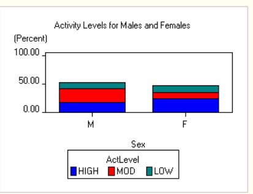

# SAS Base Software: SAS Basic Part 2

## Overview

If you have PC database files such as Microsoft Excel spreadsheets, Lotus spreadsheets, or Microsoft Access files, you can use SAS to import these files and create SAS data sets. Once you have the data in SAS data sets, you can process them as needed in SAS. You can also export SAS data to a number of PC file formats.

To read PC database files, you use the `PROC IMPORT` procedure. `PROC IMPORT` reads the input file and writes the data to a SAS data set, with the SAS variables defined based on the input records. You control the results with options and statements that are specific to the input data source.

- `PROC IMPORT` is available only on Windows and UNIX.
- You must have SAS/ACCESS Interface to PC Files licensed to read PC database files. However, even without SAS/ACCESS Interface to PC Files you can import and export delimited external files (files containing columns of data values that are separated by a delimiter such as a blank or a comma).

### <span style="color:orangered">Point-and-Click Method</span>

If you have SAS/ACCESS Interface to PC Files licensed, you can import PC database files using the Import Wizard:

1. In SAS, click **File > Import Data**.
2. When the Import Wizard opens, follow directions for importing data.

You can view and save the `PROC IMPORT` code that the Import Wizard generates.

## Example

Suppose that you want to import two files, a Microsoft Excel spreadsheet and a Microsoft Access table. The following programs show you how to read the data using options specific to the given file format, create SAS data sets, and print the new data sets.

```sas
/*********************************************/
/* import the Excel file                     */
/*********************************************/
proc import datafile="c:\myfiles\Accounts.xls"
    out=sasuser.accounts;
    sheet="Prices";
    getnames=no;
run;

/* print part of the new data set */
proc print data=sasuser.accounts(obs=10);
run;

/*********************************************/
/* import the Access file                    */
/*********************************************/
proc import table="customers"
    out=sasuser.cust dbms=access;
    uid="admin";
    pwd="";
    database="c:\myfiles\east.mdb";
    wgdb="c:\winnt\system32\security.mdb";
run;

/* print part of the new data set */
proc print data=sasuser.cust(obs=5);
run;
```
## Creating the Required .db or .mdb Files
If you don't have the database files (`east.mdb` and `security.mdb`), you can create them with the following steps:
### Tools Required

To create and manipulate Microsoft Access databases, you can use:

- **Microsoft Access**: If you have it installed.
- **MDB Viewer Plus**: A free viewer for Microsoft Access database files.
- **DB Browser for SQLite**: An open-source tool to create, design, and edit database files compatible with SQLite.

### Creating the .db or .mdb Files

- #### Using Microsoft Access:

    1. Open Microsoft Access.
    2. Create a new database and save it as `east.mdb`.
    3. Create a table named `customers` with fields such as `CustomerID`, `CustomerName`, `ContactName`, `Country`, etc.
    4. Save and close the database.
    5. Repeat the steps to create `security.mdb` if necessary.

- #### Using MDB Viewer Plus:

    1. Open MDB Viewer Plus.
    2. Create a new database and save it as `east.mdb`.
    3. Add a new table named `customers` with the required fields.
    4. Save the database.

- #### Using DB Browser for [SQLite](https://sqlitebrowser.org/dl/):

    1. **Download DB Browser for SQLite**:
        - Go to the [DB Browser for SQLite website](https://sqlitebrowser.org/dl/).
        - Download the appropriate installer for your operating system.
    
    2. **Install DB Browser for SQLite**:
        - Follow the installation instructions for your operating system.
        - Launch the application after installation.

    - ##### Creating a New Database and Table

    - ##### Step 1: Create a New Database

        1. Open DB Browser for SQLite.
        2. Click on `New Database`.
        3. Choose a location to save the new database file and name it `east.db`.
        4. Click `Save`.

    - ##### Step 2: Connect to the New Database

        - The database `east.db` is already open in DB Browser for SQLite after creation.

    - ##### Step 3: Create a Table Named `customers`

        1. In the main window, go to the `Database Structure` tab.
        2. Click on `Create Table`.
        3. Name the table `customers`.

        4. Add the required fields:
            - Field Name: `CustomerID`, Field Type: `INTEGER`
            - Field Name: `CustomerName`, Field Type: `VARCHAR(100)`
            - Field Name: `ContactName`, Field Type: `VARCHAR(100)`
            - Field Name: `Country`, Field Type: `VARCHAR(50)`
        
        5. Click `OK` to create the table.

    - ##### Step 4: Insert Sample Data into the Table

        1. Go to the `Browse Data` tab.
        2. Select the `customers` table from the dropdown menu.
        3. Click on `New Record` to add new rows and enter the following data:
        
            - CustomerID: `1`, CustomerName: `Alfreds Futterkiste`, ContactName: `Maria Anders`, Country: `Germany`
            - CustomerID: `2`, CustomerName: `Ana Trujillo Emparedados y helados`, ContactName: `Ana Trujillo`, Country: `Mexico`
            - CustomerID: `3`, CustomerName: `Antonio Moreno Taquería`, ContactName: `Antonio Moreno`, Country: `Mexico`
            - CustomerID: `4`, CustomerName: `Around the Horn`, ContactName: `Thomas Hardy`, Country: `UK`
            - CustomerID: `5`, CustomerName: `Berglunds snabbköp`, ContactName: `Christina Berglund`, Country: `Sweden`
        
        4. Click `Write Changes` to save the data into the table.
        
        Your SQLite database `east.db` with the `customers` table and sample data is now created and ready for use.

    - #### Sample Data

        Here is some sample data you can use for the `customers` table:

        | CustomerID | CustomerName                        | ContactName       | Country |
        |------------|-------------------------------------|-------------------|---------|
        | 1          | Alfreds Futterkiste                 | Maria Anders      | Germany |
        | 2          | Ana Trujillo Emparedados y helados  | Ana Trujillo      | Mexico  |
        | 3          | Antonio Moreno Taquería             | Antonio Moreno    | Mexico  |
        | 4          | Around the Horn                     | Thomas Hardy      | UK      |
        | 5          | Berglunds snabbköp                  | Christina Berglund| Sweden  |

## Importing SQLite Database in SAS

To import data from an SQLite database in SAS, follow these steps:

1. **Create the SQLite database** and populate it with the required data as described in the previous steps.

2. **Use the following SAS script** to import the data from the SQLite database:

    ```sas
    /*********************************************/
    /* Import the SQLite database                */
    /*********************************************/
    proc sql;
        connect to sqlite (database="c:\myfiles\east.db");
        
        create table sasuser.cust as
        select *
        from connection to sqlite
        (
            select * from customers
        );
        
        disconnect from sqlite;
    quit;

    /* Print part of the new data set */
    proc print data=sasuser.cust(obs=5);
    run;
    ```

3. **Explanation of the Script**:
    - `proc sql;` initiates the SQL procedure.
    - `connect to sqlite (database="c:\myfiles\east.db");` connects to the SQLite database located at `c:\myfiles\east.db`.
    - `create table sasuser.cust as select * from connection to sqlite (select * from customers);` creates a new SAS table named `cust` in the `sasuser` library by selecting all records from the `customers` table in the SQLite database.
    - `disconnect from sqlite;` terminates the connection to the SQLite database.
    - `quit;` ends the SQL procedure.
    - `proc print data=sasuser.cust(obs=5); run;` prints the first 5 records from the newly created SAS dataset `cust`.

Note: Adjust the file paths and table names as needed to match your setup.


** See these online resources to learn more about how to read PC database files.


# <span style="color:orangered">Simulating Remote Data Processing and Download in SAS </span>

This guide explains how to simulate remote data processing and download in SAS using local directories. Follow the steps below to create synthetic data, process it, and store it in the specified directories.

## Step 1: Define Libraries

First, define local and simulated remote libraries in SAS.

```sas
/*********************************************/
/* Define a Custom Library                   */
/*********************************************/
options comamid=netbios remote=netpc; 

/* Define Local and Simulated Remote Libraries */
libname lhost 'C:\Users\100XXXX\SAS-Tutorial\salesdata\local';
libname rhost 'C:\Users\100XXXX\SAS-Tutorial\salesdata\remote';

/* Create directories if they do not exist */
data _null_;
    rc1 = dcreate('local', 'C:\Users\100XXXX\SAS-Tutorial\salesdata');
    rc2 = dcreate('remote', 'C:\Users\100XXXX\SAS-Tutorial\salesdata');
run;
```

### Explanation
- `options comamid=netbios remote=netpc;` sets up communication options (commented out in this simulation).
- `libname lhost ...` and `libname rhost ...` define local and simulated remote libraries.
- The `data _null_` step creates the necessary directories if they do not exist.


## Step 2: Simulate Remote Data Processing

Next, simulate the creation and processing of data on the remote host.

```sas
/*************************************/
/* Simulate creating data on the remote host */
data rhost.master;
    input lastname $ dept $ gross;
    datalines;
Smith IT 6000
Johnson HR 4500
Williams Finance 7000
Brown Marketing 5500
Jones Sales 8000
;
run;

/* Simulate processing on the remote host */
proc sort data=rhost.master out=rhost.sales;
    where gross > 5000;
    by lastname dept;
run;
```


### Explanation
- `data rhost.master` creates a dataset named master in the simulated remote library `rhost`.
- `proc sort data=rhost.master out=rhost.sales` sorts and filters the data to include only records `where gross > 5000`.


## Step 3: Simulate Download to Local Host

Simulate the downloading of the processed data from the remote host to the local host.

```sas
/*************************************/
/* Simulate downloading data to the local host */
/* proc download data=rhost.sales out=lhost.sales; */
/* run; */

/* Simulate the downloaded dataset in the local library */
data lhost.sales;
    set rhost.sales;
run;
```

### Explanation
- The proc download step is commented out as it's part of the remote execution.
- Instead, `data lhost.sales; set rhost.sales;` simulates downloading the data by copying it from the remote library to the local library.

## Step 4: Print Data Set in Local Session
Finally, print the processed data in the local session. 
```sas
/*************************************/
/* print data set in local session   */
proc print data=lhost.sales;
run;
```
### Explanation
- `proc print data=lhost.sales;` prints the sales dataset from the local library lhost.

## Full Program
Here is the full program incorporating all the steps:


```sas
/*********************************************/
/* Define a Custom Library                   */
/*********************************************/
options comamid=netbios remote=netpc; 

/* Define Local and Simulated Remote Libraries */
libname lhost 'C:\Users\100XXXX\SAS-Tutorial\salesdata\local';
libname rhost 'C:\Users\100XXXX\SAS-Tutorial\salesdata\remote';

/* Create directories if they do not exist */
data _null_;
    rc1 = dcreate('local', 'C:\Users\100XXXX\SAS-Tutorial\salesdata');
    rc2 = dcreate('remote', 'C:\Users\100XXXX\SAS-Tutorial\salesdata');
run;

/*************************************/
/* Simulate creating data on the remote host */
data rhost.master;
    input lastname $ dept $ gross;
    datalines;
Smith IT 6000
Johnson HR 4500
Williams Finance 7000
Brown Marketing 5500
Jones Sales 8000
;
run;

/* Simulate processing on the remote host */
proc sort data=rhost.master out=rhost.sales;
    where gross > 5000;
    by lastname dept;
run;

/*************************************/
/* Simulate downloading data to the local host */
/* proc download data=rhost.sales out=lhost.sales; */
/* run; */

/* Simulate the downloaded dataset in the local library */
data lhost.sales;
    set rhost.sales;
run;

/*************************************/
/* print data set in local session   */
proc print data=lhost.sales;
run;


```

# Creating and Redefining Variables in SAS

You'll probably need to create and redefine variables in a number of ways. The following DATA steps illustrate some common ways to perform these tasks.

**Tip:** You can copy and run these programs in SAS.

## Step 1: Create Variables with INPUT

```sas
/*************************************/
/* create variables with INPUT       */
/*************************************/
data diabetes;
   input ID $ Sex $ Age Height Weight 
         Pulse FastGlucose PostGlucose;
   datalines;
2304 F 16 61 102 100 568 625
1128 M 43 71 218  76 156 208
4425 F 48 66 162  80 244 322
1387 F 57 64 142  70 177 206
9012 F 39 63 157  68 257 318
6312 M 52 72 240  77 362 413
5438 F 42 62 168  83 247 304
3788 M 38 73 234  71 486 544
9125 F 56 64 159  70 166 215
3438 M 15 66 140  67 492 547
1274 F 50 65 153  70 193 271
3347 M 53 70 193  78 271 313
2486 F 63 65 157  70 152 224
1129 F 48 61 137  69 267 319
9723 M 52 75 219  65 348 403
8653 M 49 68 185  79 259 311
4451 M 54 71 196  81 373 431
3279 M 40 70 213  82 447 504
4759 F 60 68 164  71 155 215
6488 F 59 64 154  75 362 409
;
run;
```

## Step 2: Create and Redefine Variables with Assignment and Function
```sas
/*************************************/
/* create and redefine variables     */
/* with assignment, function         */
/*************************************/
data diabetes_female;   
   set diabetes;   
   if sex='F';   
   GlucoseChange = postglucose - fastglucose;   
   fastglucose = fastglucose + fastglucose * 0.10;   
   AvgGlucose = mean(postglucose, fastglucose);
run;  

```

## Step 3: Create Variables with LENGTH
```sas
/*************************************/
/* create variables with LENGTH      */
/*************************************/
data PatientAccounts;   
   set diabetes(keep=id sex age);   
   length Group $ 8;   
   if age >= 55 then group = 'Seniors';   
   else group = 'Under 55';
run;

```

## Step 4: Create Variable with FORMAT
```sas
/*************************************/
/* create variable with FORMAT       */
/*************************************/
data sales;   
   format Sale_Price 6.2;
   Sale_Price = 49.99;
run;   

```

## Step 5: Create Variables with ATTRIB
```sas
/*************************************/
/* create variables with ATTRIB      */
/*************************************/
data sales;   
   attrib Sale_Price format = 6.2 
          label = "Sale Price";
   Sale_Price = 49.99;
run;
```


# Using Conditional Statements in SAS

The following programs illustrate several ways of using conditional logic in your DATA step programs.

**Tip:** You can copy and run the complete DATA steps below in SAS. (You can also modify the code fragments and use them in DATA steps.)

## Example 1: Conditional Logic with IF-THEN/ELSE
This example creates a dataset named `payroll` with various employee details, including their ID, sex, job code, salary, birth date, and hire date. It uses IF-THEN/ELSE statements to categorize employees into groups based on their job codes. The second DATA step creates a new dataset `highwage`, which categorizes employees into 'High', 'Low', or 'Avg' based on their salary.


```sas
/*************************************/
/* conditional logic with            */
/* IF-THEN/ELSE                      */
/*************************************/
data payroll;
   input IdNumber $ 1-4 Sex $ 6 Jobcode $ 8-10
         Salary 12-16 @18 Birth date7. 
         @26 Hired date7.;
   if jobcode='ME2' then
      Group='Mechanics'; 
   else if jobcode='PT1' then
        Group='Pilots';
   format birth hired mmddyy8.;
   datalines;    
1009 M TA1 28880 02MAR59 26MAR92
1017 M TA3 40858 28DEC57 16OCT81
1036 F TA3 39392 19MAY65 23OCT84
1037 F TA1 28558 10APR64 13SEP92
1038 F TA1 26533 09NOV69 23NOV91
1050 M ME2 35167 14JUL63 24AUG86
1065 M ME2 35090 26JAN44 07JAN87
1076 M PT1 66558 14OCT55 03OCT91
1094 M FA1 22268 02APR70 17APR91
1100 M BCK 25004 01DEC60 07MAY88
;
run;

data highwage;
   set payroll(drop=sex birth hired);
   if salary > 60000 then
      Category = "High";
   else if salary < 30000 then
        Category = "Low";
   else Category = "Avg";
run;
```
## Example 2: Other Examples of IF-THEN/ELSE (Code Fragments)
These code fragments demonstrate various uses of IF-THEN/ELSE logic, such as deleting observations, conditional incrementing of a variable, and nested IF statements with different conditions.

```sas
/*************************************/
/* other examples of IF-THEN/ELSE    */
/* (code fragments)                  */
/*************************************/
if x then delete;

if status='OK' and type=3 then count + 1;

if age ne agecheck then delete;

if x = 0 then 
   if y ne 0 then put 'X ZERO, Y NONZERO'; 
   else put 'X ZERO, Y ZERO';
else put 'X NONZERO';

if answer = 9 then
   do;
      answer = .;
      put 'INVALID ANSWER FOR ' id=;
   end;
else
   do;
      answer = answer10;
      valid + 1;
   end;
```


## Example 3: Conditional Logic with SELECT (Code Fragment)
This example uses the SELECT statement to execute different blocks of code based on the value of payclass. It's an alternative to using multiple IF-THEN/ELSE statements and is particularly useful for handling multiple conditions.

```sas
/*************************************/
/* conditional logic with SELECT     */
/* (code fragment)                   */
/*************************************/
select (payclass);
   when ('monthly') amt = salary;
   when ('hourly')
      do;
         amt = hrlywage * min(hrs,40);
         if hrs > 40 then put 'CHECK TIMECARD';
      end;         /* end of do     */
   otherwise put 'PROBLEM OBSERVATION';
end;               /* end of select */
```

## Example 4: Conditional Logic with Subsetting IF
This example demonstrates subsetting IF logic, which is used to include only specific observations in the new dataset. In this case, the dataset mechanics will include only employees with the job code 'ME2'.

```sas
/*************************************/
/* conditional logic with subsetting */
/* IF                                */
/*************************************/
data mechanics;   
   set payroll;   
   if jobcode = 'ME2';
run;

```


# Subsetting Data in SAS

Suppose you want to create two subsets of an existing SAS data set. In one case, you simply want to select observations and variables from the existing data. In the other case, you want to select some observations and variables, perform processing on the data, and keep only some of the previously selected variables in the final data set.

The following programs show you how to subset data in both these situations.

**Tip:** You can copy and run these programs in SAS.

## Step 1: Create the Initial Data Set

```sas
/*************************************/
/* create the initial data set       */
/*************************************/
data admit;
   input ID $ 1-4 Name $ 6-19 Sex $ 21 Age 23-24
         Date 26-27 Height 29-30 Weight 32-34
         ActLevel $ 36-39 Fee 41-46;
   format fee 6.2;
   datalines;
2458 Murray, W      M 27  1 72 168 HIGH  85.20
2462 Almers, C      F 34  3 66 152 HIGH 124.80
2501 Bonaventure, T F 31 17 61 123 LOW  149.75
2523 Johnson, R     F 43 31 63 137 MOD  149.75
2539 LaMance, K     M 51  4 71 158 LOW  124.80
2544 Jones, M       M 29  6 76 193 HIGH 124.80
2552 Reberson, P    F 32  9 67 151 MOD  149.75
2555 King, E        M 35 13 70 173 MOD  149.75
2563 Pitts, D       M 34 22 73 154 LOW  124.80
2568 Eberhardt, S   F 49 27 64 172 LOW  124.80
2571 Nunnelly, A    F 44 19 66 140 HIGH 149.75
2572 Oberon, M      F 28 17 62 118 LOW   85.20
2574 Peterson, V    M 30  6 69 147 MOD  149.75
2575 Quigley, M     F 40  8 69 163 HIGH 124.80
2578 Cameron, L     M 47  5 72 173 MOD  124.80
2579 Underwood, K   M 60 22 71 191 LOW  149.75
2584 Takahashi, Y   F 43 29 65 123 MOD  124.80
2586 Derber, B      M 25 23 75 188 HIGH  85.20
2588 Ivan, H        F 22 20 63 139 LOW   85.20
2589 Wilcox, E      F 41 16 67 141 HIGH 149.75
2595 Warren, C      M 54  7 71 183 MOD  149.75
;
run;
```

## Step 2: Select Observations and Variables
```sas
/*************************************/
/* select observations and variables */
/*************************************/
data subset1;
   set admit;
   if fee >= 124.80 & sex = 'M';
   keep id name age weight;
run;

```
### Explanation
- This step selects observations where `fee >= 124.80` and `sex = 'M'`.
- It keeps only the variables `id`, `name`, `age`, and `weight` in the final data set subset1.

## Step 3: Subset Data, Perform Processing, and Subset Variables Again
```sas
/*************************************/
/* subset data, perform processing,  */
/* and subset variables again        */
/*************************************/
data subset2(keep=id sex kgweight);
   set admit(drop=name date);
   if actlevel='LOW' and age > 40;
   KgWeight = weight / 2.2;
run;

```
### Explanation

## 
```sas
- This step selects observations where `actlevel = 'LOW'` and `age > 40`.
- It drops the variables `name` and `date` from the original data set.
- It creates a new variable `KgWeight` by converting `weight` from pounds to kilograms.
- It keeps only the variables `id`, `sex`, and `kgweight` in the final data set `subset2`.
```


# Displaying Date, Time, and Datetime Values in SAS

Suppose you want to display date, time, and datetime values as recognizable dates and times in a report. The first example below demonstrates how you can display a value as a date, a time, or a date and time. This program uses the DATETIME, DATE, and TIMEAMPM formats to display the value 86399 as a date and time, a calendar date, and a time, respectively. The MONTH function extracts the numeric month from the value of Date1 (86399).

The second example reads four regional meeting dates using the MMDDYY8. informat, calculates the dates on which announcements should be mailed, and writes the dates out using the DATE9. format.

The SAS program utilizes various keywords and their functionalities to effectively manage and present data. The `options` keyword sets system options to remove dates and page numbers from the report. The `data` keyword is used to create new data sets, while `input` defines the variables to read from the input data. `datalines` allows for data to be provided directly within the DATA step. The `format` keyword assigns display formats to variables, and the `month` function extracts the month from a date value. The `proc print` procedure prints data sets, with `title` and `footnote` used to set titles and footnotes for the report. The `noobs` option removes observation numbers from the report. The `set` keyword reads existing data sets into the DATA step, and `keep` and `drop` specify which variables to retain or exclude. `date9.` and `mmddyy10.` are formats and informats for displaying and reading dates in specific forms. The `mtg` variable, formatted using the `mmddyy10.` informat, represents meeting dates and is used to calculate mailing dates for announcements. Together, these keywords enable comprehensive data manipulation and presentation in SAS.


**Tip:** You can copy and run these programs in SAS.

## Example 1: Displaying Values as Date, Time, and Datetime

### Step 1: Set System Options for Report

```sas
/*************************************/
/* set system options for report     */
/*************************************/
options nodate nonumber;
```

### Step 2: Create Temporary Data Set
```sas
/*************************************/
/* create temporary data set         */
/*************************************/
data test;
   Time1 = 86399;
   format Time1 datetime.;
   Date1 = 86399;
   format Date1 date.;
   Time2 = 86399;
   format Time2 timeampm.;
   Date1Month = month(Date1);
run;

```
### Step 3: Print Data Set
```sas
/*************************************/
/* print data set                    */
/*************************************/
proc print data=test noobs;
   title 'Same Number, Different SAS Values';
   footnote1 'Time1 is a SAS DATETIME value.';
   footnote2 'Date1 is a SAS DATE value.';
   footnote3 'Time2 is a SAS TIME value.';
   footnote4 'Date1Month is the numeric month for Date1.';
run;

```
### Step 4: Clear Titles and Footnotes
```sas
/*************************************/
/* clear any titles and footnotes    */
/* in effect                         */
/*************************************/
title;
footnote;

```
These are the data values from the PROC PRINT output: 


## Example 2: Calculating and Displaying Dates
### Step 1: Set System Options for Report

```sas
/*************************************/
/* set system options for report     */
/*************************************/
options nodate nonumber;

```
### Step 2: Create Temporary Data Set

```sas
/*************************************/
/* create temporary data set         */
/*************************************/
data meeting;
   input region $ mtg : mmddyy10.;
   sendmail = mtg - 45;
   datalines;
N  11-24-99
S  12-28-99
E  12-03-99
W  10-04-99
;
run;
```
### Step 3: Print Data Set

```sas
/*************************************/
/* print data set                    */
/*************************************/
proc print data=meeting noobs;
   format mtg sendmail date9.;
   title 'When to Send Announcements';
run;

```
### Step 4: Clear Titles
```sas
/*************************************/
/* clear any titles in effect        */
/*************************************/
title;

```


# Printing Data in SAS

This program demonstrates how to list the data in two SAS data sets. For the first report, it provides a simple listing that displays selected variables and observations. For the second report, it groups data, displays subtotals for each group, and provides a grand total for the report. This is useful for generating organized and summarized reports from raw data in SAS.

**Tip:** You can copy and run these programs in SAS.

```sas
/*************************************/
/* create input data set 1           */
/*************************************/
data exprev;
   input Region $ State $ Month monyy5.
         Expenses Revenues;
   format month monyy5.;
   datalines;
Southern GA JAN95 2000  8000
Southern GA FEB95 1200  6000
Southern FL FEB95 8500 11000
Northern NY FEB95 3000  4000
Northern NY MAR95 6000  5000
Southern FL MAR95 9800 13500
Northern MA MAR95 1500  1000
;
run;

/*************************************/
/* subset and print the data set     */
/*************************************/
proc print data=exprev double;
   var month state revenues;
   where region='Southern' and revenues>=8000;
   title1 'High Monthly Revenues for';
   title2 'the Southern Region';
run;

/*************************************/
/* create input data set 2           */
/*************************************/
data pilots;
   infile datalines;
   input ID $ 1-4 LastName $ 6-15 FirstName $ 17-25
         City $ 27-38 State $ 40-41 Gender $ 43
         JobCode $ 45-47 @49 Salary @56;
   datalines;
1333 BLAIR      JUSTIN    STAMFORD     CT M PT2  88606
1739 BOYCE      JONATHAN  NEW YORK     NY M PT1  66517
1428 BRADY      CHRISTINE STAMFORD     CT F PT1  68767
1404 CARTER     DONALD    NEW YORK     NY M PT2  91376
1118 DENNIS     ROGER     NEW YORK     NY M PT3 111379
1905 GRAHAM     ALVIN     NEW YORK     NY M PT1  65111
1407 GRANT      DANIEL    MT. VERNON   NY M PT1  68096
1410 HARRIS     CHARLES   STAMFORD     CT M PT2  84685
1439 HARRISON   FELICIA   BRIDGEPORT   CT F PT1  70736
1545 HUNTER     CLYDE     STAMFORD     CT M PT1  66130
1777 LUFKIN     ROY       NEW YORK     NY M PT3 109630
1106 MARSHBURN  JASPER    STAMFORD     CT M PT2  89632
1333 NEWKIRK    SANDRA    PRINCETON    NJ F PT2  84536
1478 NEWTON     JAMES     NEW YORK     NY M PT2  84203
1556 PENNINGTON MICHAEL   NEW YORK     NY M PT1  71349
1890 STEPHENSON ROBERT    NEW YORK     NY M PT2  85896
1107 THOMPSON   WAYNE     NEW YORK     NY M PT2  89977
1830 TRIPP      KATHY     BRIDGEPORT   CT F PT2  84471
1928 UPCHURCH   LARRY     WHITE PLAINS NY M PT2  89858
1076 VENTER     RANDALL   NEW YORK     NY M PT1  66558
;
run;

/*************************************/
/* set system options for report     */
/*************************************/
options nodate pageno=1 linesize=64 pagesize=60;

/*************************************/
/* sort the data and create a        */
/* temporary output data set         */
/*************************************/
proc sort data=pilots out=tempemp;
   by jobcode gender;
run;

/*************************************/
/* print the sorted data set         */
/*************************************/
proc print data=tempemp split='*';
   id jobcode;
   by jobcode;
   var gender salary;
   sum salary;
   label jobcode='Job Code*========'
         gender='Gender*======'
         salary='Annual Salary*=============';
   format salary dollar11.2;
   where jobcode in ('PT1','PT2');
   title 'Expenses Incurred for';
   title2 'Salaries for Pilots';	
run;

/*************************************/
/* clear any titles in effect        */
/*************************************/
title;
```


# Creating Frequency Tables in SAS

## Overview

When you analyze your data, you may need to determine how variable values are distributed through the data. To do so, you can create frequency tables, which show the distribution of variable values both as percentages of a total and as counts of data.

The FREQ procedure in Base SAS creates one-way frequency tables and two-way and n-way crosstabulation tables. It can also compute measures of association and of agreement, and organize output by stratification variables.

## Example: Count Data

Suppose that you want to create:

- Simple frequency tables for selected variables in a SAS data set
- A crosstabulation table and an output data set with frequencies, percentages, and expected cell frequencies.

The following programs show you how to use PROC FREQ to perform these tasks.

**Tip:** You can copy and run these programs in SAS.

```sas
/*************************************/
/* create the input data set         */
/*************************************/
data color;
   input Region Eyes $ Hair $ Count @@;
   label eyes='Eye Color'
         hair='Hair Color'
         region='Geographic Region';
   datalines;
1 blue  fair    23  1 blue  red      7  1 blue  medium  24
1 blue  dark    11  1 green fair    19  1 green red      7
1 green medium  18  1 green dark    14  1 brown fair    34
1 brown red      5  1 brown medium  41  1 brown dark    40
1 brown black    3  2 blue  fair    46  2 blue  red     21
2 blue  medium  44  2 blue  dark    40  2 blue  black    6
2 green fair    50  2 green red     31  2 green medium  37
2 green dark    23  2 brown fair    56  2 brown red     42
2 brown medium  53  2 brown dark    54  2 brown black   13
;
run;

/*************************************/
/* create simple frequency tables    */
/*************************************/
proc freq data=color;
   tables eyes hair;
   title1 'Simple Frequency Tables';
run;

/*************************************/
/* create a crosstabulation table    */
/* and an output data set            */
/*************************************/
proc freq data=color;
   weight count;
   tables eyes*hair/out=freqcnt outexpect
          sparse;
   title1 'Crosstabulation Table';
run;

/*************************************/
/* print the output data set         */
/*************************************/
proc print data=freqcnt noobs;
   title2 'Output Data Set from PROC FREQ';
run;

/*************************************/
/* clear any titles in effect        */
/*************************************/
title;
```

## Explanations of Keyowrds
- `data`: It creates a new data set. The statement `data color;` creates a temporary data set named `color`.
- `input`: Defines the variables to read from the input data. The statement `input Region Eyes $ Hair $ Count @@;` specifies that `Region`, `Eyes`, and `Hair` are character variables and `Count` is a numeric variable.
- `label`: Assigns descriptive labels to variables. The statement `label eyes='Eye Color'` assigns the label "Eye Color" to the `eyes` variable.
- `datalines`: Provides data lines directly within the DATA step. The lines following `datalines;` are read into the data set.
- `proc freq`: Creates frequency tables. The statement `proc freq data=color;` generates frequency tables for the `color` data set.
- `tables`: Specifies the variables for which to create frequency tables. The statement `tables eyes hair;` creates frequency tables for the `eyes` and `hair` variables.
- `title`: Sets the title for the report. The statement `title1 'Simple Frequency Tables';` sets the title of the report.
- `weight`: Applies a weight variable to the analysis. The statement `weight count;` uses the `count` variable as a weight in the analysis.
- `out`: Creates an output data set. The statement `out=freqcnt` creates an output data set named `freqcnt`.
- `outexpect`: Includes expected cell frequencies in the output data set. The statement `outexpect` adds expected cell frequencies to the `freqcnt` data set.
- `sparse`: Includes all possible combinations of levels of the categorical variables in the output. The statement `sparse` ensures all combinations of `eyes` and `hair` are included in the crosstabulation table.
- `proc print`: Prints the data set. The statement `proc print data=freqcnt noobs;` prints the `freqcnt` data set without observation numbers.
- `noobs`: Removes the observation number from the report. Used in `proc print` to suppress the printing of observation numbers.
- `title2`: Sets a secondary title for the report. The statement `title2 'Output Data Set from PROC FREQ';` sets a secondary title for the report.
- `title`: Clears any titles in effect. The statement `title;` clears all titles currently in effect.


# Tabulate Data

## Overview

The TABULATE procedure gives you power and flexibility in summarizing your data in table form. You can create a variety of tables ranging from simple to highly customized, including one-, two-, and three-dimensional tables that display a large number of descriptive statistics. You can:

- Modify virtually every feature of a table
- Calculate percentages
- Produce subreports without sorting data
- Summarize data and produce a report in one step
- Generate multiple tables in one step

PROC TABULATE computes many of the same statistics that are computed by other descriptive statistical procedures such as MEANS, FREQ, and REPORT.


## Example

Suppose that you want to create two tables from one SAS data set and a third table from another SAS data set. You also want to enhance the third table by specifying style attributes for various elements of the table. The following programs show you how to perform these tasks.

**Tip:** You can copy and run these programs in SAS.

```sas
/*************************************/
/* create the first input data set   */
/*************************************/
data wghtclub; 
   input idno 1-4 name $ 6-24 team $ strtwght endwght; 
   loss = strtwght - endwght; 
   datalines; 
1023 David Shaw         red 189 165 
1049 Amelia Serrano     yellow 145 124 
1219 Alan Nance         red 210 192 
1246 Ravi Sinha         yellow 194 177 
1078 Ashley McKnight    red 127 118 
run; 

/*************************************/
/* print the data set                */
/*************************************/
proc print data=wghtclub; 
   title 'Health Club Data'; 
run; 

/*************************************/
/* create a two-dimensional table    */
/*************************************/
proc tabulate data=wghtclub; 
   class team; 
   var strtwght endwght loss; 
   table team, mean*(strtwght endwght loss);
   table mean*(strtwght endwght loss), team; 
   title 'Mean Starting Weight, Ending Weight, and Weight Loss'; 
run; 

/*************************************/
/* create the second input data set  */
/*************************************/
data patients;
   input ID $ 1-4 Name $ 6-16 Sex $ 18 Age 20-21 Date 23-24 Height 26-27 Weight 29-31 ActLevel $ 33-36 Fee 38-43;
   format fee 6.2; 
   datalines;
2458 Murray, W   M 27  1 72 168 HIGH  85.20
2462 Almers, C   F 34  3 66 152 HIGH 124.80
2523 Johnson, R  F 43 31 63 137 MOD  149.75
2539 LaMance, K  M 51  4 71 158 LOW  124.80
2544 Jones, M    M 29  6 76 193 HIGH 124.80
2552 Reberson, P F 32  9 67 151 MOD  149.75
2555 King, E     M 35 13 70 173 MOD  149.75
2563 Pitts, D    M 34 22 73 154 LOW  124.80
2571 Nunnelly, A F 44 19 66 140 HIGH 149.75
2572 Oberon, M   F 28 17 62 118 LOW   85.20
2574 Peterson, V M 30  6 69 147 MOD  149.75
2575 Quigley, M  F 40  8 69 163 HIGH 124.80
2578 Cameron, L  M 47  5 72 173 MOD  124.80
2586 Derber, B   M 25 23 75 188 HIGH  85.20
2588 Ivan, H     F 22 20 63 139 LOW   85.20
2589 Wilcox, E   F 41 16 67 141 HIGH 149.75
2595 Warren, C   M 54  7 71 183 MOD  149.75
;
run;

/*************************************/
/* specify HTML output               */
/*************************************/
ods html body='table.htm' style=default;

/*************************************/
/* create a two-dimensional table    */
/* with style elements specified     */
/*************************************/
proc tabulate data=patients style=[font_weight=bold]; 
   class actlevel;
   classlev actlevel / style=[just=left]; 
   var age height weight / style=[font_size=3]; 
   keyword all sum / style=[font_width=wide]; 
   keylabel all="All Patients"; 
   table (actlevel="Activity Level" all*[style=[background=yellow]]), (age height weight*f=best10.2)*mean / style=[background=white] misstext=[label="Missing" style=[font_weight=light]] box=[label="Patient Info by Activity Level" style=[font_style=italic]];
   title 'Enhanced Table';
run;

/*************************************/
/* close the HTML destination        */
/*************************************/
ods html close;

/*************************************/
/* clear any titles in effect        */
/*************************************/
title;
```
### Explanation: 
- The `data` step creates two data sets, `wghtclub` and `patients`, with information about health club members and patients, respectively.
- The `proc print` step prints the `wghtclub` data set with a title. 
- The `proc tabulate` step creates two-dimensional tables. The first `proc tabulate` generates summary statistics for `wghtclub`, and the second generates summary statistics for `patients`, with customized style attributes specified for various elements of the table.
- The `ods html` statement specifies HTML output for the enhanced table from the `patients` data set, which includes style customizations such as font weight, justification, font size, and background color.


# Query Data Overview

Structured Query Language (SQL) is a standardized, widely used language that retrieves and updates data in tables and views based on those tables. If you're familiar with SQL, you can quickly create queries in SAS by using the SQL procedure in Base SAS.

PROC SQL is the SAS implementation of SQL. When you want to examine relationships between data values, subset your data, or compute values, the SQL procedure provides an easy, flexible way to analyze your data. Using PROC SQL, you can:
- Retrieve and manipulate data that is stored in tables or views.
- Create tables, views, and indexes on columns in tables.
- Create SAS macro variables that contain values from rows in a query's result.
- Add or modify the data values in a table's columns or insert and delete rows. You can also modify the table itself by adding, modifying, or dropping columns.
- Send DBMS-specific SQL statements to a database management system (DBMS) and retrieve DBMS data.

You can use SAS language elements such as global statements, data set options, functions, informats, and formats with PROC SQL just as you can with other SAS procedures. However, because PROC SQL implements Structured Query Language, it works somewhat differently from other Base SAS procedures.

This task focuses on retrieving data from a single table (data set). For details on joining tables, see Join tables.

## Point-and-Click Method

You can create SQL queries using a point-and-click interface:
1. In SAS, click Tools then Query.
2. Use the SQL Query windows to create queries.
3. You can view and save the PROC SQL code that the SQL Query window generates.

# Query Data Example

Suppose that you want to create two queries of payroll information. In the first query, you want to retrieve data and calculate the number, average age, and average salary of employees in each job code. In the second, you want to create a new table of salary and bonus information for each employee. The following programs show you how to perform these tasks.

**Tip:** You can copy and run these programs in SAS.

```sas
/*************************************/
/* create the input table (data set) */
/*************************************/
data payroll;
   input IdNumber $ 1-4 Sex $ 6 Jobcode $ 8-10
         Salary 12-16 @18 Birth date7. 
         @26 Hired date7.;
   format birth hired mmddyy8.;
   datalines;    
1009 M TA1 28880 02MAR59 26MAR92
1017 M TA3 40858 28DEC57 16OCT81
1036 F TA3 39392 19MAY65 23OCT84
1037 F TA1 28558 10APR64 13SEP92
1038 F TA1 26533 09NOV69 23NOV91
1050 M ME2 35167 14JUL63 24AUG86
1065 M ME2 35090 26JAN44 07JAN87
1076 M PT1 66558 14OCT55 03OCT91
1094 M FA1 22268 02APR70 17APR91
1100 M BCK 25004 01DEC60 07MAY88
;
run;

/*************************************/
/* retrieve data using a query       */
/*************************************/
proc sql;
   select Jobcode,
          count(jobcode) as number label='Number',
          avg(int((today()-birth)/365.25)) as avgage
             format=2. label='Average Age',
          avg(salary) as avgsal
             format=dollar8. label='Average Salary'
      from payroll
      group by jobcode
      having avgage ge 30;
   title1 'Summary Information for Each Job Category';
   title2 'Average Age 30 or Over';
quit;

/*************************************/
/* create a new table from a query   */
/*************************************/
proc sql;
   create table bonus as
      select IdNumber, Salary format=dollar8.,
             salary*.025 as Bonus format=dollar8.
         from payroll;
   title 'BONUS Information';
   select *
      from bonus;
quit;

/*************************************/
/* clear any titles in effect        */
/*************************************/
title;
```
## Explanation

**Create the Input Table**: The `data` step creates an input data set named `payroll` containing employee information such as ID number, sex, job code, salary, birth date, and hire date.

**Retrieve Data Using a Query**: The first `proc sql` step retrieves data from the `payroll` data set, calculates the number of employees, average age, and average salary for each job code where the average age is 30 or over. The results are displayed with titles.

**Create a New Table from a Query**: The second `proc sql` step creates a new table named `bonus` that includes the ID number, salary, and calculated bonus (2.5% of salary) for each employee. The results are displayed with the title 'BONUS Information'.

**Clear Titles**: The `title;` statement clears any titles in effect.

## Output

The output file name specified for HTML output is `table.htm`.

### Sample Output

**Summary Information for Each Job Category**:

```text
Jobcode   Number   Average Age   Average Salary
TA1       3        31            $28,057
TA3       2        32            $40,125
ME2       2        35            $35,129
PT1       1        38            $66,558

#### BONUS Information:
```text
IdNumber   Salary   Bonus
1009       $28,880  $722
1017       $40,858  $1,021
1036       $39,392  $985
1037       $28,558  $714
1038       $26,533  $663
1050       $35,167  $879
1065       $35,090  $877
1076       $66,558  $1,664
1094       $22,268  $557
1100       $25,004  $625
```


# Join Tables

## Overview

If you read Query Data, you saw ways to query a single table using PROC SQL. However, you often need data from separate tables. When you specify multiple tables, views, or query-expressions in the FROM clause, PROC SQL processes them to form one table. The resulting table contains data from each contributing table. These queries are referred to as joins.

Conceptually, when you specify two tables, PROC SQL matches each row of table A with all the rows of table B to produce an internal or intermediate table known as the Cartesian product. The Cartesian product of large tables can be huge, so typically you want to subset data by declaring the join type. There are two types of joins:

- **Inner Joins**: Return a result table for all the rows in a table that have one or more matching rows in the other table or tables.
  
- **Outer Joins**: Are inner joins that are augmented with rows that did not match with any row from the other table in the join. There are three kinds of outer joins: left, right, and full.

This task focuses on joining tables. For details on querying single tables, see Query Data.

## Point-and-Click Method

You can join tables using a point-and-click interface.

1. In SAS, click Tools then Query.
2. Use the SQL Query windows to perform joins.
3. You can view and save the PROC SQL code that the SQL Query window generates.

# Example

Suppose that you want to create several queries that require joining two tables. For examples, you want to determine:
- Which U.S. cities are south of Cairo, Egypt
- The coordinates of the capitals of international cities
- The population of a city only if the city is the capital of a country
- The populations and/or coordinates of world cities.

The following programs show you how to perform joins to find the information you need.

**Tip:** You can copy and run these programs in SAS. To create the input data for the programs, copy this file, paste it into the SAS editor, and submit the code.

```sas
/*************************************/
/* join tables (inner join)          */
/*************************************/
proc sql;
   title 'Oil Production/Reserves of Countries';
   select p.country, barrelsperday 'Production', 
          barrels 'Reserves'
      from oilprod p, oilrsrvs r
      where p.country = r.country
      order by barrelsperday desc;
quit;

/*************************************/
/* join tables (left outer join)     */
/*************************************/
proc sql;
   title 'Coordinates of Capital Cities';
   select Capital format=$20., 
          Name 'Country' format=$20., 
          Latitude, Longitude
      from countries a left join 
           worldcitycoords b
           on a.Capital = b.City and
              a.Name = b.Country
      order by Capital;
quit;

/*************************************/
/* join tables (right outer join)    */
/*************************************/
proc sql;
   title 'Populations of Capitals Only';
   select City format=$20., 
          Country 'Country' format=$20., 
          Population
      from countries right join 
           worldcitycoords 
           on Capital = City and
              Name = Country
      order by City;
quit;

/*************************************/
/* join tables (full outer join)     */
/*************************************/
proc sql;   
   title 'Populations/Coordinates of World Cities';
   select City '#City#(WORLDCITYCOORDS)' format=$20.,
          Capital '#Capital#(COUNTRIES)' format=$20.,
          Population, Latitude, Longitude
      from countries full join 
           worldcitycoords
           on Capital = City and
              Name = Country; 
quit;

/*************************************/
/* clear any titles in effect        */
/*************************************/
title;
```
## Explanation

**Inner Join**: The first `proc sql` block performs an inner join on `oilprod` and `oilrsrvs` tables to display oil production and reserves for each country.

**Left Outer Join**: The second `proc sql` block performs a left outer join on `countries` and `worldcitycoords` tables to display coordinates of capital cities.

**Right Outer Join**: The third `proc sql` block performs a right outer join on `countries` and `worldcitycoords` tables to display populations of capital cities only.

**Full Outer Join**: The fourth `proc sql` block performs a full outer join on `countries` and `worldcitycoords` tables to display populations and coordinates of world cities.

**Clear Titles**: The `title;` statement clears any titles in effect.

## Output

### Sample Output

**Oil Production/Reserves of Countries**:

```markdown
Country       Production      Reserves
--------------------------------------
Country1      1000000         5000000
Country2      800000          4000000
```

**Coordinates of Capital Cities**:
```markdown
Capital       Country         Latitude   Longitude
--------------------------------------------------
Capital1      Country1        34.00      -118.25
Capital2      Country2        51.50      -0.12
```
**Populations of Capitals Only**:
```markdown
City          Country         Population
----------------------------------------
Capital1      Country1        1000000
Capital2      Country2        1500000


```
**Populations/Coordinates of World Cities**:
```markdown
City                Capital             Population   Latitude   Longitude
-------------------------------------------------------------------------
WorldCity1          Capital1            1000000      34.00      -118.25
WorldCity2          Capital2            1500000      51.50      -0.12
```

# Create Plots

## Overview

An effective way to examine the relationship between variables is to plot their values. To produce single or overlaid plots, you can use:
- The `PLOT` procedure in Base SAS to visualize data quickly.
- The `GPLOT` procedure in SAS/GRAPH software to produce presentation-quality graphics that include color and various fonts.

In addition, you can create `PROC GPLOT` output using the SAS/GRAPH Control for ActiveX, which enables you to embed interactive graphs in web pages and OLE documents.

The syntax for the two procedures is very similar, although `PROC GPLOT` offers a number of additional formatting capabilities. This task shows you both ways of creating various types of plots.

### Point-and-Click Methods

If you have SAS/GRAPH licensed, you can create presentation-quality plots using a point-and-click interface.
1. In SAS, click Solutions then Reporting then Graph-N-Go.
2. Click the New SAS Data Set icon and select data for the chart.
3. Click the icon for the desired plot type and drop it on the workspace. Then double-click the plot object, select your data source as the data model, and specify variables and plot options.
4. You can view and save the `PROC GPLOT` code that Graph-N-Go generates.

### Example

Suppose that you want to create several plots, including:
- A single and overlaid plot to show general trends and patterns in your data.
- A single plot with connected data points for a report.
- An interactive overlaid plot with filled areas for a presentation.

The following programs show you how to create the plots you need.

**Tip:** You can copy and run these programs in SAS. To create the input data for the programs, copy the following file, paste it into the SAS editor, and submit the code.
```sas
/*************************************/
   /* create the Stocks data set        */
   /*************************************/
data stocks;
   input Year @7 DateOfHigh:date9. 
         DowJonesHigh @26 DateOfLow:date9. 
         DowJonesLow;
   format LogDowHigh LogDowLow 5.2 
          DateOfHigh DateOfLow date9.;
   LogDowHigh=log(DowJonesHigh);
   LogDowLow=log(DowJonesLow);
   datalines;
1954  31DEC1954  404.39  11JAN1954  279.87
1955  30DEC1955  488.40  17JAN1955  388.20
1956  06APR1956  521.05  23JAN1956  462.35
1957  12JUL1957  520.77  22OCT1957  419.79
1958  31DEC1958  583.65  25FEB1958  436.89
1959  31DEC1959  679.36  09FEB1959  574.46
1960  05JAN1960  685.47  25OCT1960  568.05
1961  13DEC1961  734.91  03JAN1961  610.25
1962  03JAN1962  726.01  26JUN1962  535.76
1963  18DEC1963  767.21  02JAN1963  646.79
1964  18NOV1964  891.71  02JAN1964  768.08
1965  31DEC1965  969.26  28JUN1965  840.59
1966  09FEB1966  995.15  07OCT1966  744.32
1967  25SEP1967  943.08  03JAN1967  786.41
1968  03DEC1968  985.21  21MAR1968  825.13
1969  14MAY1969  968.85  17DEC1969  769.93
1970  29DEC1970  842.00  06MAY1970  631.16
1971  28APR1971  950.82  23NOV1971  797.97
1972  11DEC1972 1036.27  26JAN1972  889.15
1973  11JAN1973 1051.70  05DEC1973  788.31
1974  13MAR1974  891.66  06DEC1974  577.60
1975  15JUL1975  881.81  02JAN1975  632.04
1976  21SEP1976 1014.79  02JAN1976  858.71
1977  03JAN1977  999.75  02NOV1977  800.85
1978  08SEP1978  907.74  28FEB1978  742.12
1979  05OCT1979  897.61  07NOV1979  796.67
1980  20NOV1980 1000.17  21APR1980  759.13
1981  27APR1981 1024.05  25SEP1981  824.01
1982  27DEC1982 1070.55  12AUG1982  776.92
1983  29NOV1983 1287.20  03JAN1983 1027.04
1984  06JAN1984 1286.64  24JUL1984 1086.57
1985  16DEC1985 1553.10  04JAN1985 1184.96
1986  02DEC1986 1955.57  22JAN1986 1502.29
1987  25AUG1987 2722.42  19OCT1987 1738.74
1988  21OCT1988 2183.50  20JAN1988 1879.14
1989  09OCT1989 2791.41  03JAN1989 2144.64
1990  16JUL1990 2999.75  11OCT1990 2365.10
1991  31DEC1991 3168.83  09JAN1991 2470.30
1992  01JUN1992 3413.21  09OCT1992 3136.58
1993  29DEC1993 3794.33  20JAN1993 3241.95
1994  31JAN1994 3978.36  04APR1994 3593.35
1995  13DEC1995 5216.47  30JAN1995 3832.08
1996  27DEC1996 6560.91  10JAN1996 5032.94
1997  06AUG1997 8259.31  11APR1997 6391.69
1998  23NOV1998 9374.27  31AUG1998 7539.07
;
run;
```

### Creating Plots

#### Create a Single Plot (PROC PLOT)

This plot will display `dowjoneshigh` values on the y-axis and `year` values on the x-axis.

```sas
/*************************************/
/* create a single plot (PROC PLOT)  */
/*************************************/
proc plot data=stocks;
   plot dowjoneshigh*year='*';
   title 'High Dow Jones Values';
   title2 'from 1954 to 1998';
run;
quit;
```
#### Create Overlaid Plots (PROC PLOT)
This plot will display `dowjoneshigh` and `dowjoneslow` values on the y-axis, with `year` values on the x-axis.

```sas
/*************************************/
/* create overlaid plots (PROC PLOT) */
/*************************************/
proc plot data=stocks;
   plot dowjoneshigh*year='*'
        dowjoneslow*year='o' / overlay box;
   title 'Plot of Highs and Lows';
   title2 'for the Dow Jones Industrial Average';
run;
quit;

```
#### Create a Single Plot and Connect Plot Data Points (PROC GPLOT)
This plot will display `dowjoneshigh` values on the y-axis and `year` values on the x-axis, with additional formatting options.
```sas
/*************************************/
/* create a single plot and connect  */
/* plot data points (PROC GPLOT)     */
/*************************************/
proc gplot data=stocks;
   plot dowjoneshigh*year / haxis=1955 to 1995 by 5
                            vaxis=0 to 6000 by 1000
                            hminor=3
                            vminor=1
                            vref=1000 3000 5000
                            lvref=2
                            cvref=blue
                            caxis=blue
                            ctext=red;
   symbol1 color=red
           interpol=join
           value=dot
           height=1;
   title1 'Dow Jones Yearly Highs';
run;
quit;

```
#### Create Interactive Overlaid Plots with Filled Areas (PROC GPLOT, ODS, and ActiveX)
This plot will display `dowjoneslow` and `dowjoneshigh` values on the y-axis, with `year` values on the x-axis, using additional style elements for interactivity
```sas
### Create Interactive Overlaid Plots with Filled Areas (PROC GPLOT, ODS, and ActiveX)

This plot will display `dowjoneslow` and `dowjoneshigh` values on the y-axis, with `year` values on the x-axis, using additional style elements for interactivity.

```sas
/*************************************/
/* create interactive overlaid plots */
/* with filled areas (PROC GPLOT,    */
/* ODS, and ActiveX)                 */
/*************************************/
ods html body='plot.htm';
goptions reset=global gunit=pct border cback=white
         colors=(blue red) ctext=black
         ftitle=swissb ftext=swiss htitle=6 htext=4
         device=activex; 
proc gplot data=stocks;
   plot dowjoneslow*year 
        dowjoneshigh*year / overlay
                            haxis=axis1
                            hminor=4
                            vaxis=axis2
                            vminor=1
                            caxis=black
                            areas=2;
   symbol1 interpol=join;
   axis1 order=(1955 to 1995 by 5) offset=(2,2)
         label=none
         major=(height=2)
         minor=(height=1);
   axis2 order=(0 to 6000 by 1000) offset=(0,0)
         label=none
         major=(height=2)
         minor=(height=1);
run;
quit;
ods html close;

/*************************************/
/* clear any titles in effect        */
/*************************************/
title;

```
### Sample Output

**Single Plot**: A plot showing high Dow Jones values from 1954 to 1998.

**Overlaid Plots**: A plot showing both high and low Dow Jones values over the years.

**Single Plot with Connected Data Points**: A plot showing yearly highs of Dow Jones with connected data points.

**Interactive Overlaid Plots with Filled Areas**: An interactive plot showing both high and low Dow Jones values over the years with filled areas.


# Create Charts

## Overview

You can use the `CHART` procedure in Base SAS for producing:
- Vertical and horizontal bar charts
- Block charts
- Pie charts
- Star charts

These types of charts graphically display values of a variable or a statistic associated with those values. The charted variable can be numeric or character.

`PROC CHART` is a useful tool to visualize data quickly, but if you need to produce presentation-quality graphics that include color and various fonts, you can use SAS/GRAPH software. The `GCHART` procedure in SAS/GRAPH produces the same types of charts as `PROC CHART` does, as well as donut charts. In addition, you can create `PROC GCHART` output using the SAS/GRAPH Control for ActiveX, which enables you to embed interactive graphs in web pages and OLE documents.

As you'll see, the syntax for `PROC CHART` and `PROC GCHART` is very similar. This task shows you both ways of creating various types of charts.

### Point-and-Click Method

If you have SAS/GRAPH licensed, you can create presentation-quality charts using a point-and-click interface.
1. In SAS, click Solutions then Reporting then Graph-N-Go.
2. Click the New SAS Data Set or New MDDB icon and select data for the chart.
3. Click the icon for the desired chart type and drop it on the workspace. Then double-click the chart object, select your data source as the data model, and specify columns, statistics, and chart options.
4. You can view and save the `PROC GCHART` code that Graph-N-Go generates.

### Example

Suppose that you want to create several graphs: a bar chart to give you a sense of your data, some pie charts to put in a report, and an interactive bar chart to use in a presentation. The following programs show you how to create these charts using `PROC CHART` and `PROC GCHART`.

**Tip:** You can copy and run these programs in SAS.

```sas
/*************************************/
/* create the input data set         */
/*************************************/
data fitness;
   input Age Sex $ HeartRate 
         Exercise Aerobic;
datalines;
28  M  86  2   36.6
41  M  76  3   26.7
30  M  78  2   33.8
39  F  90  1   13.6
28  M  96  1   33.
26  M  74  2   42.7
 .  F  66  4   36.1
48  F  72  2   22.6
31  M  60  3   44.1
28  F  84  2   22.1
33  F  56  4   21.3
37  F  78  2   30.3
46  M  84  1   34.2
23  M  72  2   38.1
25  F  88  1   32.0
37  F  72  2   43.7
42  M  60  3   36.7
44  F  78  3   21.6
 .  F  70  1   22.8
25  F  60  3   36.1
24  F  74  2   29.9
29  F  66  4   38.9
27  M  62  4   44.0
24  M  72  3   44.2
36  F  80  1   26.2
24  M  82  2   18.7
23  M  54  3   70.6
28  F  76  1   23.8
30  F  66  2   28.9
25  M  54  3   41.3
48  F  72  2   28.9
23  F  68  1   18.9
22  F  78  2   39.0
23  F  66  3   36.1
46  F  54  3   28.9
31  F  84  1   21.6
45  M  60  2   47.8
27  M  90  2   43.1
26  M  66  2   28.9
26  F  84  2     .
24  M  72  3   50.1
32  F  72  1   15.7
29  M  54  3   44.8
48  F  66  2   28.9
36  F  66  2   33.2
;
run;

/*************************************/
/* create a bar chart (PROC CHART)   */
/*************************************/
proc chart data=fitness;
   vbar age / type=mean
              sumvar=heartrate
              group=sex
              midpoints=(20 30 40 50);
   where exercise=1;
   title1 'Average Heart Rate by Age and Sex';
   title2 'for Exercise Group 1';
run;
quit;
title;

/*************************************/
/* create pie charts (PROC GCHART)   */
/*************************************/
proc gchart data=fitness;
   pie sex / type=mean
             fill=solid
             sumvar=aerobic;
   pie3d exercise / type=mean
                    sumvar=heartrate 
                    group=sex
                    discrete
                    across=2 
                    fill=solid
                    ctext=blue 
                    explode=4
                    slice=arrow 
                    noheading;
run;
quit;

/*************************************/
/* create an interactive bar chart   */
/* (PROC GCHART, ODS, and ActiveX)   */
/*************************************/
ods html body='barchart.htm';
goptions device=activex;
proc gchart data=fitness;
   axis1 order=(0 to 20 by 2)
         label=('Number of People')
         minor=(number=1)
         offset=(0,0);   
   axis2 label=('Age ' j=r 'Group');   
   hbar3d age / midpoints=(20 30 40 50)
                freq
                freqlabel='Total in Group'
                subgroup=sex
                autoref
                maxis=axis2
                raxis=axis1
                coutline=black;   
   title1 'Fitness Program Participants';
run;
quit;
ods html close;

/*************************************/
/* clear any titles in effect        */
/*************************************/
title;

```

### Explanation

**Create a Bar Chart (PROC CHART)**: This bar chart will display average `HeartRate` values on the y-axis for different `age` groups on the x-axis, grouped by `sex`.

**Create Pie Charts (PROC GCHART)**: These pie charts will display mean `aerobic` values by `sex` and mean `heartrate` values by `exercise`, grouped by `sex`.

**Create an Interactive Bar Chart (PROC GCHART, ODS, and ActiveX)**: This bar chart will display the frequency of different `age` groups on the x-axis, with `sex` as a subgroup.

### Output

The output file name specified for HTML output is `barchart.htm`.

### Sample Output

**Bar Chart**: A bar chart showing average heart rate by age and sex for exercise group 1.

**Pie Charts**: Pie charts showing mean aerobic values by sex and mean heart rate values by exercise.

**Interactive Bar Chart**: An interactive bar chart showing the frequency of different age groups, grouped by sex.



