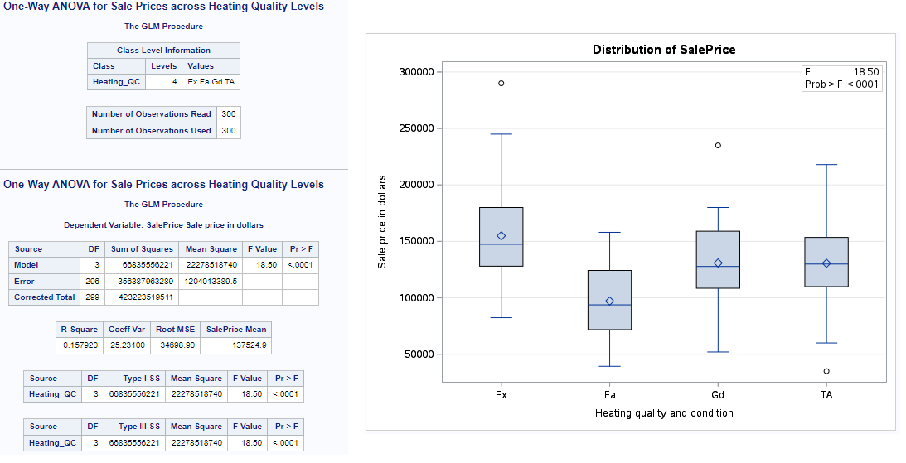
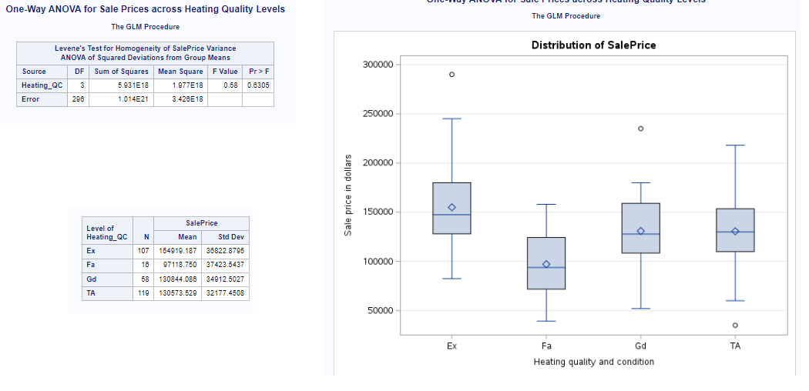
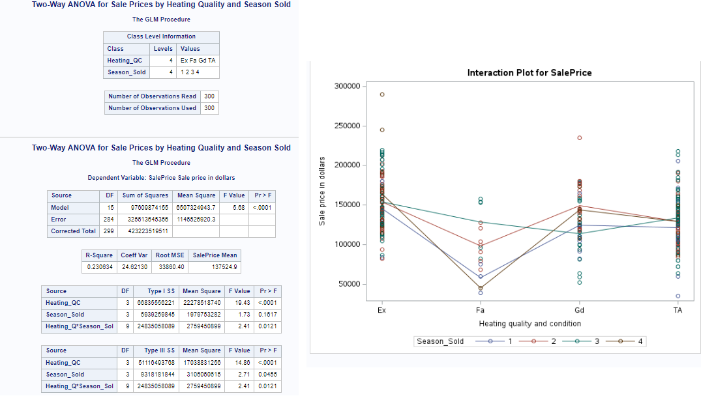
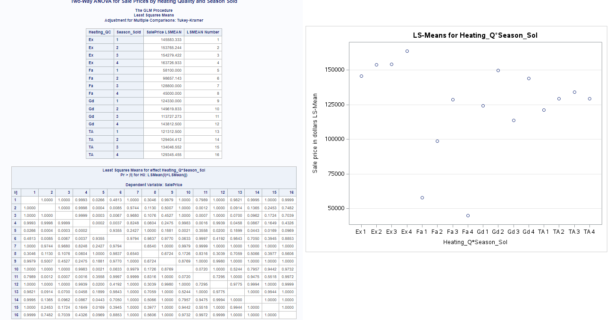

# Analysis of Variance (ANOVA) on AmesHousing3 Dataset

## Introduction

Analysis of Variance (ANOVA) is a statistical method used to test if there are significant differences between the means of three or more independent groups. This blog post will explore the different types of ANOVA, their differences, how ANOVA differs from t-tests, and when to use ANOVA over t-tests. We will then apply these concepts using SAS Studio with the `ameshousing3` dataset.

## Types of ANOVA

### 1. One-Way ANOVA

- **Purpose:** Compares the means of three or more independent groups based on one independent variable.
- **Example:** Comparing sale prices across different heating quality levels.
  - **Dependent Variable:** Sale Price
  - **Independent Variable:** Heating Quality

### 2. Two-Way ANOVA

- **Purpose:** Examines the effect of two independent variables on one dependent variable, including the interaction effect between the two variables.
- **Example:** Evaluating sale prices based on heating quality and the season sold.
  - **Dependent Variable:** Sale Price
  - **Independent Variables:** Heating Quality, Season Sold

### 3. Repeated Measures ANOVA

- **Purpose:** Compares means across multiple measurements of the same individuals or subjects.
- **Example:** Comparing test scores of students at multiple points in time.
  - **Dependent Variable:** Test Scores
  - **Independent Variable:** Time (multiple measurements)

## Differences Between Types of ANOVA

- **One-Way vs. Two-Way ANOVA:** One-Way ANOVA involves one independent variable, while Two-Way ANOVA involves two independent variables and can assess interaction effects.
- **Two-Way ANOVA vs. Repeated Measures ANOVA:** Two-Way ANOVA involves different subjects for each group, whereas Repeated Measures ANOVA involves the same subjects measured multiple times.

## ANOVA vs. t-Tests

### t-Tests

- **Purpose:** Compares the means of two groups.
- **Types:**
  - **Independent Samples t-Test:** Compares means of two independent groups.
  - **Paired Samples t-Test:** Compares means of two related groups (e.g., before and after measurements).
- **Example:** Comparing the average sale price of houses with central air conditioning to those without.

### ANOVA

- **Purpose:** Compares the means of three or more groups.
- **Example:** Comparing the average sale price of houses across different heating quality levels.

### When to Use ANOVA Over t-Tests

- **Multiple Groups:** When comparing the means of three or more groups, use ANOVA instead of multiple t-tests to avoid increasing the Type I error rate.
- **Interaction Effects:** When you need to examine the interaction effects between two independent variables, use Two-Way ANOVA.

## Applying ANOVA on AmesHousing3 Dataset

### 1. One-Way ANOVA: Comparing Sale Prices Across Different Heating Quality Levels

#### Hypothesis

- **Null Hypothesis (H0):** The mean Sale Prices are equal across different Heating Quality levels.
- **Alternative Hypothesis (H1):** At least one mean Sale Price is different across Heating Quality levels.

#### Assumptions

1. Independent observations.
2. Normal distribution of residuals.
3. Equal variances across groups.

#### SAS Code for One-Way ANOVA

```sas
/* Step 1: Assign a library reference */
libname mydata '/home/u63922XXX/SAS24';

/* Step 2: Read the dataset */
data ames;
    set mydata.ameshousing3;
run;

/* Step 3: Display the first 10 observations */
proc print data=ames (obs=10);
run;

/* Step 4: Perform One-Way ANOVA */
proc glm data=ames;
    class Heating_QC;
    model SalePrice = Heating_QC;
    means Heating_QC / hovtest=levene;
    title "One-Way ANOVA for Sale Prices across Heating Quality Levels";
run;
quit;

/*
- proc glm: This statement calls the General Linear Model (GLM) procedure in SAS, which is used for fitting general linear models. It can handle a variety of statistical analyses, including ANOVA.
- class: This statement is used to specify categorical variables in the model. The GLM procedure needs to know which variables are categorical to treat them appropriately in the analysis. Heating_QC: The categorical variable representing Heating Quality, which has different levels (e.g., Ex, Fa, Gd, TA).
- model: This statement specifies the model to be fitted. It defines the dependent variable and the independent variables (predictors)
- SalePrice = Heating_QC: Indicates that Sale Price is the dependent variable, and Heating Quality is the independent variable. The procedure will analyze the effect of Heating Quality on Sale Price
- hovtest=levene: Requests the Levene's test for homogeneity of variances. This test checks whether the variances are equal across the different groups of Heating Quality.
/*
```
## Interpretation

The ANOVA table provides the F-statistic and the p-value to determine if there are significant differences between the group means. If the p-value is less than 0.05, we reject the null hypothesis, indicating significant differences in mean Sale Prices across Heating Quality levels.

### Explanation of the Results

#### One-Way ANOVA for Sale Prices Across Heating Quality Levels

The One-Way ANOVA test is used to compare the means of Sale Prices across different levels of Heating Quality (`Heating_QC`). The results include F-statistics and p-values to determine if there are significant differences between the group means.

**Dependent Variable:** Sale Price  
**Independent Variable:** Heating Quality (`Heating_QC`)

**ANOVA Table:**
| Source | DF | Sum of Squares | Mean Square | F Value | Pr > F |
|--------|----|----------------|-------------|---------|--------|
| Model  | 3  | 66835556221    | 22278518740 | 18.50   | <.0001 |
| Error  | 296| 356387963289   | 1204013389.5|         |        |
| Corrected Total | 299| 423223519511  |             |         |        |
- Model: Represents the variation explained by the Heating Quality variable.
- Error: Represents the unexplained variation or residual error.
- Corrected Total: The total variation in the Sale Prices.
- F Value: 18.50
- Pr > F: <.0001
- DF (Degrees of Freedom): The number of independent values or quantities that can be assigned to a statistical distribution. In the ANOVA table, DF represents the number of levels minus one for the model and the number of observations minus the number of groups for the error.


**Model Summary:**
- **R-Square:** 0.157920
- **Coeff Var:** 25.23100
- **Root MSE:** 34698.90
- **Mean SalePrice:** 137524.9

**Type I and Type III Sum of Squares:**
| Source      | DF | Type I SS      | Mean Square     | F Value | Pr > F  |
|-------------|----|----------------|-----------------|---------|---------|
| Heating_QC  | 3  | 66835556221    | 22278518740     | 18.50   | <.0001  |

**Levene's Test for Homogeneity of Variance:**
| Source     | DF | Sum of Squares  | Mean Square     | F Value | Pr > F  |
|------------|----|-----------------|-----------------|---------|---------|
| Heating_QC | 3  | 5.931E18        | 1.977E18        | 0.58    | 0.6305  |
| Error      | 296| 1.014E21        | 3.426E18        |         |         |

**Group Means:**
| Level of Heating_QC | N  | SalePrice Mean | Std Dev      |
|---------------------|----|----------------|--------------|
| Ex                  | 107| 154919.187     | 36822.8795   |
| Fa                  | 16 | 97118.750      | 37423.5437   |
| Gd                  | 58 | 130844.086     | 34912.5027   |
| TA                  | 119| 130573.529     | 32177.4508   |

#### Interpretation of the Results

- **ANOVA Table:** The p-value for the `Heating_QC` is less than 0.0001, indicating that there are significant differences in Sale Prices across the different levels of Heating Quality. The F Value of 18.50 is relatively high, reinforcing the significance.
- **R-Square:** 0.157920 indicates that approximately 15.79% of the variability in Sale Prices can be explained by Heating Quality.
- **Levene's Test:** The p-value of 0.6305 indicates that we fail to reject the null hypothesis of equal variances, suggesting that the assumption of homogeneity of variances is met.
- **Group Means:** The means and standard deviations for Sale Prices across the different levels of Heating Quality (`Ex`, `Fa`, `Gd`, `TA`) provide insight into how the Sale Prices differ across these groups.

#### Box Plot Explanation

The box plot provides a visual representation of the distribution of Sale Prices across different Heating Quality levels:

- **Boxes:** Each box represents the interquartile range (IQR) of the Sale Prices (the range between the 25th and 75th percentiles).
- **Lines Inside Boxes:** The horizontal line inside each box represents the median Sale Price for that Heating Quality level.
- **Whiskers:** The vertical lines (whiskers) extend from the boxes to the minimum and maximum values within 1.5 times the IQR from the quartiles.
- **Outliers:** Points outside the whiskers are considered outliers and are plotted individually.
- **Diamonds:** The diamonds represent the mean Sale Price for each Heating Quality level.

The box plot shows that the `Ex` (Excellent) level of Heating Quality has the highest median Sale Price, followed by `TA` (Typical/Average), `Gd` (Good), and `Fa` (Fair). The spread of the data (IQR) and the presence of outliers are also visible, providing additional context to the ANOVA results.

#### Visuals Generated




### Visualizing the Results

### Interpretation

#### Median Sale Prices:
- **Ex (Excellent):** The median Sale Price is the highest among the four categories.
- **Fa (Fair):** The median Sale Price is the lowest.
- **Gd (Good) and TA (Typical/Average):** The median Sale Prices are similar and fall between those of Ex and Fa.

#### Mean Sale Prices (Diamonds):
- The mean Sale Prices generally follow the same trend as the medians.
- **Ex:** Highest mean Sale Price.
- **Fa:** Lowest mean Sale Price.
- **Gd and TA:** Means are close and lie between those of Ex and Fa.

#### Spread of Data (IQR):
- **Ex:** The IQR is relatively large, indicating a wider spread of Sale Prices.
- **Fa:** The IQR is the smallest, indicating a more compact distribution of Sale Prices.
- **Gd and TA:** The IQRs are moderate, suggesting a moderate spread of Sale Prices.

#### Outliers:
- Outliers are present in all categories, but their number and position vary.
- **Ex:** Outliers above the box plot, indicating higher Sale Prices.
- **Fa, Gd, TA:** Outliers also present, indicating variability in Sale Prices.

#### F-Statistic and P-Value:
- **F Value:** 18.50
- **Pr > F:** <.0001
- The F-statistic and p-value indicate that there are significant differences in Sale Prices across the different levels of Heating Quality. A p-value less than 0.0001 means that the differences observed are highly unlikely to be due to chance.

### Key Takeaways
- **Significant Differences:** The ANOVA results (with a p-value < 0.0001) indicate that the differences in Sale Prices across Heating Quality levels are statistically significant.
- **Higher Sale Prices for Excellent Quality:** Homes with excellent heating quality (Ex) have significantly higher Sale Prices compared to the other categories.
- **Variation in Sale Prices:** There is considerable variation in Sale Prices within each category, as indicated by the IQR and the presence of outliers.
- **Comparative Analysis:** The typical/average (TA) and good (Gd) categories have similar Sale Prices, which are higher than those in the fair (Fa) category but lower than those in the excellent (Ex) category.


## 2. Two-Way ANOVA: Evaluating SalePrice Based on Heating Quality and Season Sold

### Hypothesis

- **Null Hypothesis (H0):** The mean Sale Prices are equal across Heating Quality levels and Season Sold.
- **Alternative Hypothesis (H1):** At least one mean Sale Price is different across Heating Quality levels or Season Sold.

### Assumptions

1. Independent observations.
2. Normal distribution of residuals.
3. Equal variances across groups.
4. Random assignment within blocks.
5. Constant treatment effects across block levels.

### SAS Code for Two-Way ANOVA

```sas
/* Step 1: Assign a library reference */
libname mydata '/home/u63922XXX/SAS24';

/* Step 2: Read the dataset */
data ames;
    set mydata.ameshousing3;
run;

/* Step 3: Perform Two-Way ANOVA */
proc glm data=ames;
    class Heating_QC Season_Sold;
    model SalePrice = Heating_QC Season_Sold Heating_QC*Season_Sold;
    lsmeans Heating_QC*Season_Sold / slice=Heating_QC pdiff adjust=tukey;
    title "Two-Way ANOVA for Sale Prices by Heating Quality and Season Sold";
run;
quit;

/*
Class: Specifies the categorical variables Heating_QC and Season_Sold.
Model: Defines the dependent variable SalePrice and the independent variables Heating_QC, Season_Sold, and their interaction Heating_QC*Season_Sold.
LSMeans: Least-squares means, used for comparing means when there are unequal sample sizes.
Slice: Used to make comparisons within levels of another factor.
Pdiff: Requests p-values for pairwise differences.
Adjust=Tukey: Adjusts for multiple comparisons using the Tukey method
/*
```
## Interpretation

The Two-Way ANOVA table provides F-statistics and p-values for the main effects of Heating Quality and Season Sold, as well as their interaction effect. A significant interaction effect indicates that the effect of Heating Quality on Sale Prices depends on the Season Sold.



## Explanation of the Results
#### ANOVA Table

**ANOVA Table:**
| Source                | DF  | Sum of Squares | Mean Square   | F Value | Pr > F  |
|-----------------------|-----|----------------|---------------|---------|---------|
| Model                 | 15  | 97080974155    | 650729494.37  | 5.68    | <.0001  |
| Error                 | 284 | 325613643565   | 1148528902.03 |         |         |
| Corrected Total       | 299 | 423223519511   |               |         |         |

**Model Summary:**
| R-Square | Coeff Var | Root MSE | SalePrice Mean |
|----------|-----------|----------|----------------|
| 0.230834 | 24.82130  | 33860.40 | 137524.9       |

**Type I and Type III Sum of Squares:**
| Source                | DF  | Type I SS       | Mean Square   | F Value | Pr > F  |
|-----------------------|-----|-----------------|---------------|---------|---------|
| Heating_QC            | 3   | 66835556221     | 22278518740   | 19.43   | <.0001  |
| Season_Sold           | 3   | 6399529845      | 1979973282    | 1.73    | 0.1611  |
| Heating_QC*Season_Sold| 9   | 23850580889     | 2758953432    | 2.41    | 0.0121  |

### Model Fit:
- **R-Square:** The value of 0.230834 indicates that approximately 23.08% of the variability in Sale Prices can be explained by the model, which includes Heating Quality, Season Sold, and their interaction.
- **Coefficient of Variation (Coeff Var):** The value is 24.82130, which gives a sense of the relative amount of variability in the Sale Prices.
- **Root Mean Square Error (Root MSE):** The value is 33860.40, representing the standard deviation of the residuals.

### ANOVA Results:
- **Heating_QC:** The p-value (<.0001) indicates that there are significant differences in Sale Prices across the different Heating Quality levels. The F Value of 19.43 is high, confirming the significance.
- **Season_Sold:** The p-value (0.1611) suggests that there are no significant differences in Sale Prices across the different seasons sold. The F Value of 1.73 supports this.
- **Heating_QC*Season_Sold:** The p-value (0.0121) indicates that there is a significant interaction effect between Heating Quality and Season Sold on Sale Prices. The F Value of 2.41 confirms the significance of the interaction.

### Interaction Plot:
- The interaction plot shows how Sale Prices vary across different levels of Heating Quality and Season Sold.
  - **Non-Parallel Lines:** The lines for the different seasons sold (1, 2, 3, 4) are not parallel, indicating an interaction effect. This means that the effect of Heating Quality on Sale Prices depends on the season sold.

### Visual Trends:
- **Ex (Excellent):** Sale Prices are generally higher across all seasons.
- **Fa (Fair):** Sale Prices are the lowest across all seasons.
- **Gd (Good) and TA (Typical/Average):** Sale Prices show varying trends across seasons but are generally higher than Fa and lower than Ex.
This Two-Way ANOVA analysis demonstrates that Heating Quality has a significant impact on Sale Prices, while the season sold does not independently affect Sale Prices significantly. However, the interaction between Heating Quality and Season Sold is significant, suggesting that the effect of Heating Quality on Sale Prices varies depending on the season sold. 




#### Least Squares Means Table

| Heating_QC | Season_Sold | SalePrice LSMEAN | LSMEAN Number |
|------------|-------------|------------------|---------------|
| Ex         | 1           | 145853.333       | 1             |
| Ex         | 2           | 153765.244       | 2             |
| Ex         | 3           | 151079.462       | 3             |
| Ex         | 4           | 163729.933       | 4             |
| Fa         | 1           | 98657.143        | 5             |
| Fa         | 2           | 128800.000       | 6             |
| Fa         | 3           | 45000.000        | 7             |
| Fa         | 4           | 45000.000        | 8             |
| Gd         | 1           | 124330.000       | 9             |
| Gd         | 2           | 149169.833       | 10            |
| Gd         | 3           | 113727.273       | 11            |
| Gd         | 4           | 143812.500       | 12            |
| TA         | 1           | 121312.500       | 13            |
| TA         | 2           | 129404.412       | 14            |
| TA         | 3           | 134046.552       | 15            |
| TA         | 4           | 129345.455       | 16            |

This table shows the least squares means (LSMeans) for the interaction of Heating Quality and Season Sold. Each combination of Heating Quality and Season Sold has an associated LSMean value for SalePrice.

#### LS-Means Interaction Plot


The LS-Means interaction plot visualizes the interaction effect of Heating Quality and Season Sold on Sale Prices. Each point represents the LSMean for a specific combination of Heating Quality and Season Sold.

#### Key Observations from the LS-Means Plot

1. **Ex (Excellent):**
   - Sale Prices are generally higher for all seasons.
   - The highest Sale Prices are observed in Season 4.

2. **Fa (Fair):**
   - Sale Prices are the lowest for all seasons.
   - The Sale Prices for Seasons 3 and 4 are particularly low.

3. **Gd (Good):**
   - Sale Prices show variability across seasons but are generally higher than Fa.
   - Season 2 shows the highest Sale Prices for Gd.

4. **TA (Typical/Average):**
   - Sale Prices are generally moderate and show less variability across seasons compared to other categories.

#### Least Squares Means Comparison Table

The table provides pairwise comparisons of the LSMeans for each combination of Heating Quality and Season Sold. The p-values indicate whether the differences between the LSMeans are statistically significant.


## Visualizing the Results

### Interaction Plot

We can use the `PROC SGPLOT` procedure to visualize the interaction between Heating Quality and Season Sold.

### SAS Code for Interaction Plot

```sas
/* Step 1: Assign a library reference */
libname mydata '/home/u63922XXX/SAS24';

/* Step 2: Read the dataset */
data ames;
    set mydata.ameshousing3;
run;

/* Step 3: Interaction Plot */
proc sgplot data=ames;
    scatter x=Season_Sold y=SalePrice / group=Heating_QC;
    series x=Season_Sold y=SalePrice / group=Heating_QC lineattrs=(pattern=solid);
    xaxis label="Season Sold";
    yaxis label="Sale Price";
    title "Interaction Plot for Sale Price by Heating Quality and Season Sold";
run;
```

## Explanation of the Code

### Generate the Interaction Plot:


```sas
proc sgplot data=ames;
    scatter x=Season_Sold y=SalePrice / group=Heating_QC;
    series x=Season_Sold y=SalePrice / group=Heating_QC lineattrs=(pattern=solid);
    xaxis label="Season Sold";
    yaxis label="Sale Price";
    title "Interaction Plot for Sale Price by Heating Quality and Season Sold";
run;

```
- **PROC SGPLOT:** The procedure used to create the interaction plot.
- **SCATTER Statement:** Creates a scatter plot with `Season_Sold` on the x-axis and `SalePrice` on the y-axis, grouping the points by `Heating_QC`.
- **SERIES Statement:** Connects the points with lines, also grouped by `Heating_QC`.
- **XAXIS and YAXIS Labels:** Custom labels for the axes.
- **TITLE Statement:** Adds a title to the plot.

## Explanation of the Results

- **Interaction Plot:** The plot visualizes the interaction between Heating Quality and Season Sold on Sale Prices. Each line represents a different level of Heating Quality, showing how the Sale Price varies with the Season Sold.
- **Significance of Interaction:** If the lines are not parallel, it suggests an interaction between Heating Quality and Season Sold, meaning the effect of Heating Quality on Sale Prices depends on the Season Sold.

## Conclusion

In this tutorial post, we covered the different types of ANOVA, their differences, and when to use ANOVA over t-tests. We then demonstrated how to perform One-Way and Two-Way ANOVA using SAS Studio with the `ameshousing3` dataset. We found significant differences in Sale Prices across Heating Quality levels and observed that the effect of Heating Quality on Sale Prices depends on the Season Sold.

By understanding and applying ANOVA, we can gain valuable insights into the factors affecting property sales, which can inform decision-making in real estate and other fields.
