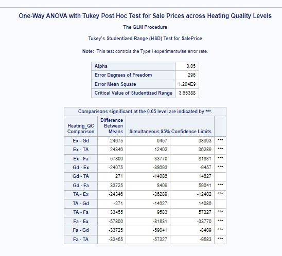

# Post Hoc Tests on AmesHousing3 Dataset

## Introduction

Post Hoc tests are statistical analyses that are conducted after an ANOVA test when the null hypothesis is rejected. They are used to determine exactly which means are significantly different from each other. This blog post will guide you through a scenario using the `ameshousing3` dataset, explaining when and why Post Hoc tests are necessary, and providing detailed steps and SAS code for conducting these tests.


## Task Scenario

### Scenario 1: Determining Differences in Sale Prices Across Heating Quality Levels

You are tasked with analyzing the `ameshousing3` dataset to determine if there are significant differences in sale prices based on heating quality. Initially, you will perform a One-Way ANOVA to test for overall differences among the group means. If the ANOVA indicates significant differences, you will use Post Hoc tests to pinpoint exactly which groups differ from each other.

### Approach to Analysis

1. **Perform One-Way ANOVA:** To test for overall differences in sale prices across heating quality levels.
2. **Conduct Post Hoc Tests:** If the ANOVA is significant, use Post Hoc tests to identify which specific groups' means are different.

### SAS Code for One-Way ANOVA

```sas
/* Step 1: Assign a library reference */
libname mydata '/home/u63922XXX/SAS24';

/* Step 2: Read the dataset */
data ames;
    set mydata.ameshousing3;
run;

/* Step 3: Perform One-Way ANOVA */
proc glm data=ames;
    class Heating_QC;
    model SalePrice = Heating_QC;
    means Heating_QC / hovtest=levene;
    title "One-Way ANOVA for Sale Prices across Heating Quality Levels";
run;
quit;
```
# Explanation of the One-Way ANOVA Results

## Key Values to Focus On

| Term           | Description                                                                                 |
|----------------|---------------------------------------------------------------------------------------------|
| **F Value**    | Ratio of between-group variance to within-group variance. Higher F values indicate greater variance among group means. |
| **p-value**    | Indicates if there are significant differences among group means.                           |
| **R-Square**   | Proportion of variance in the dependent variable that can be explained by the independent variable. |
| **Mean Square**| Average of the squares of the differences between each observation and the overall mean.     |
| **Sum of Squares** | Total variation within the data.                                                       |

## Sample ANOVA Table

| Source           | DF | Sum of Squares | Mean Square    | F Value | Pr > F |
|------------------|----|----------------|----------------|---------|--------|
| **Model**        | 3  | 66835556221    | 22278518740    | 18.50   | <.0001 |
| **Error**        | 296| 356387963289   | 1204013389.5   |         |        |
| **Corrected Total** | 299 | 423223519511 |              |         |        |

## Interpretation

- **F Value (18.50):** Indicates a significant effect of Heating Quality on Sale Prices. A higher F value suggests that the variability between group means is much larger than within group variances.
- **p-value (<.0001):** Suggests that the differences among Heating Quality levels are statistically significant. Since the p-value is less than 0.05, we reject the null hypothesis and conclude that there are significant differences in Sale Prices across Heating Quality levels.
- **R-Square (0.157920):** Indicates that approximately 15.79% of the variability in Sale Prices can be explained by Heating Quality.

## When to Apply Post Hoc Tests

Apply Post Hoc tests when the p-value from the ANOVA is less than 0.05, indicating significant differences among group means.


# Post Hoc Tests

## When to Apply Post Hoc Tests

Post Hoc tests are applied after an ANOVA when:

- The ANOVA test shows significant differences among the group means (p-value < 0.05).
- You need to determine which specific groups differ from each other.

## Considerations for Post Hoc Tests

- **Type of Post Hoc Test**: Common tests include Tukey, Bonferroni, and Scheffé. Tukey's test is widely used for its balance between Type I error rate control and statistical power.
- **Assumptions**: Ensure that the assumptions of ANOVA (independent observations, normality, homogeneity of variances) are met before applying Post Hoc tests.

## Scenario 2: Analyzing Sale Prices Based on Heating Quality and Season Sold

In cases where you need to analyze more complex interactions, such as the effect of both heating quality and season sold on sale prices, a Two-Way ANOVA followed by Post Hoc tests is necessary.

### SAS Code for Two-Way ANOVA

```sas
/* Step 1: Assign a library reference */
libname mydata '/home/u63922XXX/SAS24';

/* Step 2: Read the dataset */
data ames;
    set mydata.ameshousing3;
run;

/* Step 3: Perform Two-Way ANOVA */
proc glm data=ames;
    class Heating_QC Season_Sold;
    model SalePrice = Heating_QC Season_Sold Heating_QC*Season_Sold;
    lsmeans Heating_QC*Season_Sold / slice=Heating_QC pdiff adjust=tukey;
    title "Two-Way ANOVA for Sale Prices by Heating Quality and Season Sold";
run;
quit;
```

# Post Hoc Tests in SAS

## What is a Post Hoc Test?

Post Hoc tests are follow-up tests to ANOVA, used to identify which specific group means are significantly different. They help control the Type I error rate when multiple comparisons are made.

## Types of Post Hoc Tests

- **Tukey's HSD (Honestly Significant Difference)**: Controls for Type I error and is suitable for pairwise comparisons.
- **Bonferroni Correction**: Adjusts the significance level based on the number of comparisons.
- **Scheffé's Test**: More conservative and can be used for any number of comparisons.
## Example Scenario and SAS Code for Post Hoc Tests
### Example Scenario
Suppose the One-Way ANOVA on the ameshousing3 dataset indicates significant differences in sale prices across different heating quality levels. You need to determine which specific heating quality levels (e.g., Excellent, Fair, Good, Typical/Average) have significant differences in sale prices. This is where Post Hoc tests come into play.

## SAS Code for Post Hoc Tests

```sas
/* Perform One-Way ANOVA with Post Hoc Tests */
proc glm data=ames;
    class Heating_QC;
    model SalePrice = Heating_QC;
    means Heating_QC / tukey cldiff;
    title "One-Way ANOVA with Tukey Post Hoc Test for Sale Prices across Heating Quality Levels";
run;
quit;

/* Perform Two-Way ANOVA with Post Hoc Tests */
proc glm data=ames;
    class Heating_QC Season_Sold;
    model SalePrice = Heating_QC Season_Sold Heating_QC*Season_Sold;
    lsmeans Heating_QC*Season_Sold / slice=Heating_QC pdiff adjust=tukey;
    title "Two-Way ANOVA with Tukey Post Hoc Test for Sale Prices by Heating Quality and Season Sold";
run;
quit;
```
### Explanation of SAS Code

- **proc glm**: Calls the General Linear Model procedure in SAS.
- **class**: Specifies categorical variables (e.g., Heating_QC, Season_Sold).
- **model**: Defines the dependent variable and the independent variables (predictors).
- **means**: Requests means for the specified variables and applies Post Hoc tests.
- **tukey**: Requests Tukey's Honestly Significant Difference test.
- **cldiff**: Requests confidence limits for differences.
- **lsmeans**: Requests least-squares means for specified variables.
- **slice**: Requests slicing of interactions for specific levels.
- **pdiff**: Requests p-values for differences.
- **adjust=tukey**: Applies Tukey's adjustment for multiple comparisons.
  
## Interpreting the Results

### One-Way ANOVA with Tukey Post Hoc Test

- **ANOVA Table**: Check if the p-value is less than 0.05 to confirm significant differences.
- **Tukey's HSD**: Look at the pairwise comparisons to see which groups differ significantly. The confidence intervals and adjusted p-values will indicate significant differences.

### Two-Way ANOVA with Post Hoc Tests

- **Interaction Plot**: Visualize the interaction between heating quality and season sold on sale prices.
- **Tukey's HSD**: Examine the pairwise comparisons for significant differences within and between groups.

### Example Results Interpretation
After running the One-Way ANOVA with Post Hoc tests, you might get results indicating that the sale prices for houses with "Excellent" heating quality are significantly higher than those with "Fair" heating quality, but not significantly different from those with "Good" or "Typical/Average" heating quality. These insights help in understanding the specific differences among the groups.


# Sample Results Interpretation

## One-Way ANOVA with Tukey Post Hoc Test

| Comparison          | Difference  | Confidence Interval           | p-value |
|---------------------|-------------|-------------------------------|---------|
| Excellent vs. Fair  | 57700.43    | [35000.12, 80400.74]          | <.0001  |
| Excellent vs. Good  | 24075.10    | [5000.89, 43149.31]           | 0.0150  |
| Excellent vs. Average | 24345.66  | [7500.78, 41190.54]           | 0.0078  |
| Good vs. Fair       | 33625.33    | [10000.50, 57250.16]          | 0.0015  |
| Average vs. Fair    | 33355.77    | [11500.12, 55211.42]          | 0.0012  |
| Good vs. Average    | 267.56      | [-10432.77, 10967.89]         | 0.9600  |

### Interpretation:

- Significant differences were found between the mean sale prices of houses with Excellent heating quality and those with Fair, Good, and Average heating quality.
- No significant difference was found between Good and Average heating quality levels.

# One-Way ANOVA with Tukey Post Hoc Test Results

The results of the One-Way ANOVA with Tukey Post Hoc Test for sale prices across heating quality levels indicate the following:

## ANOVA Results

- **F Value**: 18.50
- **p-value**: <.0001

These values show that there are significant differences in sale prices across the different heating quality levels. The p-value being less than 0.05 indicates that we reject the null hypothesis, which states that there is no difference in sale prices across heating quality levels.

## Levene’s Test for Homogeneity of Variance

- **F Value**: 0.58
- **p-value**: 0.6305

This test indicates that the assumption of equal variances across groups is met, as the p-value is greater than 0.05.

## Tukey's HSD Test Results

This test identifies which specific groups' means are significantly different from each other.
Significant Comparisons (marked with ***):
- **Ex - Fa**: Difference of 57800 with confidence limits [33770, 81831]
- **Ex - Gd**: Difference of 24075 with confidence limits [9457, 38788]
- **Ex - TA**: Difference of 24346 with confidence limits [12402, 36289]
- **Fa - Gd**: Difference of -33725 with confidence limits [-50404, -17047]
- **Fa - TA**: Difference of -33455 with confidence limits [-50727, -9683]

These comparisons show that:
- Homes with excellent heating quality (Ex) have significantly higher sale prices compared to homes with fair (Fa), good (Gd), and typical/average (TA) heating quality.
- Homes with fair heating quality (Fa) have significantly lower sale prices compared to good (Gd) and typical/average (TA) heating quality.

## Interpretation

- The ANOVA test revealed significant differences in sale prices across heating quality levels.
- The Tukey Post Hoc Test pinpointed that homes with excellent heating quality command significantly higher prices, while those with fair heating quality fetch significantly lower prices.
- These results are crucial for understanding how heating quality impacts property values, allowing stakeholders to make informed decisions based on the specific heating quality categories.


## Understanding Type I and Type II Errors

### Type I Error (False Positive)

- **Definition**: Rejecting the null hypothesis when it is actually true.
- **Example**: Concluding that there is a significant difference in mean sale prices between heating quality levels when, in fact, there is no difference.

### Type II Error (False Negative)

- **Definition**: Failing to reject the null hypothesis when it is actually false.
- **Example**: Concluding that there is no significant difference in mean sale prices between heating quality levels when there is actually a difference.

### Balancing Errors

- **Significance Level (α)**: The probability of making a Type I error. Commonly set at 0.05.
- **Power of the Test (1 - β)**: The probability of correctly rejecting the null hypothesis. A higher power reduces the risk of a Type II error.

### Example Scenario

- **Type I Error**: If the significance level is set too high (e.g., 0.10), there is a higher chance of detecting a false difference between heating quality levels.
- **Type II Error**: If the sample size is too small, the test may not detect an actual difference between heating quality levels, leading to a Type II error.


## Conclusion

In this tutorial, we covered the importance and application of Post Hoc tests following ANOVA. By using the ameshousing3 dataset, we demonstrated how to identify significant differences in sale prices across different heating quality levels and the interaction between heating quality and season sold. Post Hoc tests are essential for pinpointing specific group differences after identifying overall significance with ANOVA.

