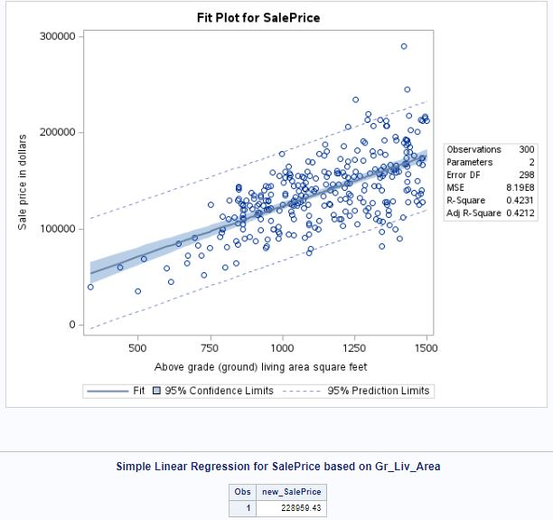

# Pearson Correlation and Simple Linear Regression on AmesHousing3 Dataset

## Pearson Correlation

Pearson Correlation is a statistical measure that calculates the strength and direction of the linear relationship between two variables. This blog post will guide you through a scenario using the `ameshousing3` dataset, explaining when and why Pearson Correlation is necessary, and providing detailed steps and SAS code for conducting this analysis.

## Task Scenario

### Scenario: Evaluating the Relationship Between SalePrice and GrLivArea

You are tasked with analyzing the `ameshousing3` dataset to determine if there is a significant linear relationship between the sale price of houses (`SalePrice`) and the ground living area (`Gr_Liv_Area`).

### Approach to Analysis

1. **Calculate Pearson Correlation**: To measure the strength and direction of the relationship between SalePrice and GrLivArea.
2. **Interpret the Correlation Coefficient**: Determine if the correlation is significant and understand its implications.

### SAS Code for Pearson Correlation

```sas
/* Step 1: Assign a library reference */
libname mydata '/home/u63922XXX/SAS24';

/* Step 2: Read the dataset */
data ames;
    set mydata.ameshousing3;
run;

/* Step 3: Calculate Pearson Correlation */
proc corr data=ames;
    var SalePrice Gr_Liv_Area;
    title "Pearson Correlation Between SalePrice and Gr_Liv_Area";
run;
```

## Interpretation of the Pearson Correlation Results

### Key Values to Focus On

| Term                           | Description                                                                               |
|--------------------------------|-------------------------------------------------------------------------------------------|
| **Pearson Correlation Coefficient (r)** | Measures the strength and direction of the linear relationship between two variables.     |
| **p-value**                    | Indicates if the correlation coefficient is significantly different from zero.             |
| **N**                          | Number of observations.                                                                    |

### Sample Correlation Table

| Variable     | N   | Pearson Correlation | p-value  |
|--------------|-----|---------------------|----------|
| **SalePrice**| 300 | 0.708               | <.0001   |
| **GrLivArea**| 300 |                     |          |

### Interpretation

- **Pearson Correlation Coefficient (0.708)**: Indicates a strong positive linear relationship between SalePrice and GrLivArea. As the ground living area increases, the sale price tends to increase as well.
- **p-value (<.0001)**: Suggests that the correlation is statistically significant. Since the p-value is less than 0.05, we reject the null hypothesis that there is no linear relationship between the variables.

### Conclusion

The Pearson Correlation analysis on the ameshousing3 dataset shows a significant positive linear relationship between SalePrice and GrLivArea. This insight helps in understanding how the size of the living area impacts the sale price of houses.

# Simple Linear Regression on AmesHousing3 Dataset

Simple Linear Regression is a statistical method that models the relationship between a dependent variable and an independent variable by fitting a linear equation to observed data. This blog post will guide you through a scenario using the ameshousing3 dataset, explaining when and why Simple Linear Regression is necessary, and providing detailed steps and SAS code for conducting this analysis.

## Task Scenario

### Scenario: Predicting SalePrice Based on GrLivArea

You are tasked with analyzing the ameshousing3 dataset to develop a model that predicts the sale price of houses (SalePrice) based on the ground living area (Gr_Liv_Area).

## Approach to Analysis

1. **Fit a Simple Linear Regression Model**: To understand the relationship between SalePrice and GrLivArea.
2. **Interpret the Regression Coefficients**: Determine the impact of GrLivArea on SalePrice.

## SAS Code for Simple Linear Regression

```sas
/* Step 1: Assign a library reference */
libname mydata '/home/u63922XXX/SAS24';

/* Step 2: Read the dataset */
data ames;
    set mydata.ameshousing3;
run;

/* Step 3: Fit a Simple Linear Regression Model */
proc reg data=ames;
    model SalePrice = Gr_Liv_Area;
    title "Simple Linear Regression for SalePrice based on Gr_Liv_Area";
run;
quit;
```

## Interpretation of the Regression Results

### Key Values to Focus On

| Term           | Description                                                                                 |
|----------------|---------------------------------------------------------------------------------------------|
| **Intercept**  | The expected value of the dependent variable (SalePrice) when the independent variable (GrLivArea) is zero. |
| **Slope**      | The change in the dependent variable (SalePrice) for a one-unit change in the independent variable (GrLivArea). |
| **R-Square**   | Proportion of variance in the dependent variable that can be explained by the independent variable. |
| **p-value**    | Indicates if the regression coefficients are significantly different from zero.             |
| **Standard Error** | Measures the accuracy of the regression coefficients.                                     |

### Sample Regression Output

| Parameter      | Estimate   | Standard Error | t Value | p-value |
|----------------|------------|----------------|---------|---------|
| **Intercept**  | 18583      | 8213.43837     | 2.26    | 0.0244  |
| **GrLivArea**  | 105.18902  | 7.11522        | 14.78   | <.0001  |
| **R-Square**   | 0.4231     |                |         |         |

### Interpretation

- **Intercept (18583)**: When the ground living area is zero, the expected sale price of a house is $18,583.
- **Slope (105.18902)**: For every additional square foot of ground living area, the sale price is expected to increase by $105.19.
- **R-Square (0.4231)**: Approximately 42.31% of the variability in SalePrice can be explained by GrLivArea.
- **p-value (<.0001)**: Indicates that the relationship between SalePrice and GrLivArea is statistically significant.


## Model Output Interpretation




### Regression Equation

The regression equation derived from the model is:
$$ y = b_0 + b_1 x $$

Where:

- (y) is the predicted sale price.
- (b_0) is the intercept.
- (b_1) is the slope (coefficient for GrLivArea).

From the regression output, we get:

- Intercept (b_0): 18583
- Slope (b_1): 105.188

So the equation becomes:
$$ y = 18583 + 105.188 * Gr_Liv_Area $$

### Step 4: Predicting SalePrice for a New House

We use the regression model to predict the sale price for a new house with 1000 sq ft of living area.

```sas
/* Example: Predicting SalePrice for a new house with 1000 sq ft of living area */
data new_data;
    input Gr_Liv_Area;
    datalines;
1000
;
run;

proc reg data=ames outest=est;
    model SalePrice = Gr_Liv_Area;
run;

data prediction;
    set est;
    new_SalePrice = Intercept + 105.188 * 1000;
run;

proc print data=prediction;
    var new_SalePrice;
run;
```
## Explanation of the Code

- `data new_data;`: Creates a new dataset named `new_data`.
- `input Gr_Liv_Area;`: Specifies the variable `Gr_Liv_Area`.
- `datalines;`: Starts the inline data input.
- `1000`: Represents the ground living area for prediction.
- `proc reg data=ames outest=est;`: Fits the regression model and saves the coefficients in `est`.
- `model SalePrice = Gr_Liv_Area;`: Defines the regression model.
- `data prediction;`: Creates a new dataset named `prediction`.
- `set est;`: Reads in the estimated coefficients.
- `new_SalePrice = Intercept + 105.188 * 1000;`: Calculates the predicted sale price.
- `proc print data=prediction;`: Prints the predicted sale price.
- `var new_SalePrice;`: Specifies the variable to print.

## Predicted Sale Price Calculation

Given the intercept (18583) and slope (105.188), the predicted sale price for a house with 1000 sq ft of living area is calculated as:
$$
new\_SalePrice = 18583 + 105.188 * 1000 = 18583 + 105188 = 123771
$$

Thus, the predicted sale price for the house is $123,771.


### Conclusion

The Simple Linear Regression analysis on the ameshousing3 dataset shows a significant positive relationship between SalePrice and GrLivArea. This model helps in predicting the sale price of houses based on their ground living area, providing valuable insights for real estate analysis.
